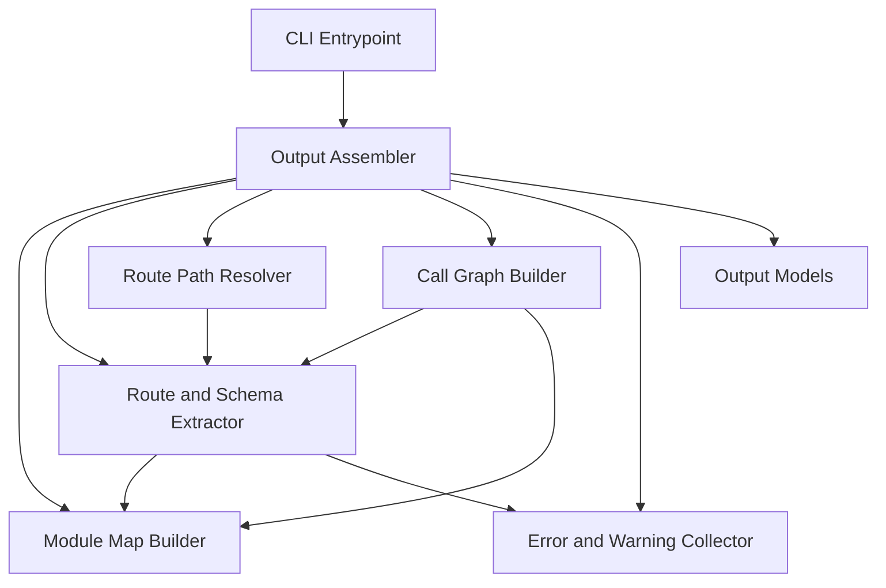
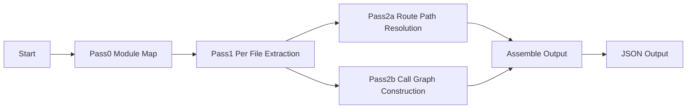

# 技術設計書: backend-route-extractor

## Overview

Backend Route Extractorは、対象プロジェクトの`backend/`配下にあるFastAPI(Python)コードを`libcst`による静的解析(AST)で読み取り、ルート定義・スキーマ参照・呼び出しグラフ(関数単位/ファイル単位)を統合した構造化JSONを出力するCLIツールである。

**Purpose**: route-linkage-engineおよびvscode-extension-uiが必要とする「バックエンドのルート⇄呼び出し構造」データを、対象プロジェクトを実行せずに提供する。
**Users**: route-linkage-engine(連携マッチングの入力)、vscode-extension-ui(拡張本体からCLIを起動し、3階層可視化の入力として利用)。
**Impact**: greenfieldのため既存システムへの変更はない。新規にPythonパッケージ`apivista-backend-analysis`(`pyproject.toml`で定義済み)としてリポジトリに追加する。

### Goals
- `backend/`配下のFastAPIルートデコレータからHTTPメソッド・完全URLパス・ハンドラ関数を抽出する
- ハンドラに関連するPydanticスキーマ参照を抽出する
- ハンドラを起点とした関数単位・ファイル単位の呼び出しグラフを構築する
- 上記を1つのスキーマ付きJSONとして出力し、部分的な解析失敗があっても処理を継続する

### Non-Goals
- フロントエンド解析、連携マッチング、UI描画(他3スペックの責務)
- 動的解析・実行時トレース、デコレータ以外のルート登録方式
- VSCode拡張からのこのCLIの起動・配布方式(vscode-extension-uiの責務)
- 出力JSON SchemaからのTypeScript型生成(消費側スペックの責務)

## Boundary Commitments

### This Spec Owns
- `backend/`配下のPythonコードに対するAST解析パイプライン(モジュールマップ構築・ルート抽出・呼び出しグラフ構築)
- 出力データの構造定義(Pydanticモデル、JSON Schema、`schemaVersion`)
- CLIの入出力契約(引数、stdout/stderrの使い分け、終了コード、`errors`/`warnings`配列の形式)

### Out of Boundary
- フロントエンドコードの解析(frontend-call-extractor)
- ルートと呼び出しの連携マッチング(route-linkage-engine)
- UI/Webview描画、ソースジャンプ(vscode-extension-ui)
- 出力JSON SchemaからのTS型生成、CLIの呼び出し・バンドル・実行環境準備(uv/uvx等の起動方法は消費側であるvscode-extension-uiが決定)
- `backend/`ディレクトリの自動検出・複数候補からの選択(呼び出し側がディレクトリパスを指定する前提)

### Allowed Dependencies
- `libcst>=1.4`(AST解析)、`pydantic>=2.12`(出力モデル・JSON Schema生成)
- Python標準ライブラリのみ(対象プロジェクトの依存パッケージは解析・実行しない)
- 開発時: `pytest`, `ruff`(`pyproject.toml`の`dependency-groups.dev`)

### Revalidation Triggers
- 出力JSON Schemaの構造変更(フィールド追加・削除・型変更) → `schemaVersion`をインクリメントし、route-linkage-engine/vscode-extension-uiに再検証を要求
- CLIの引数仕様・終了コード・stdout/stderrの使い分けの変更
- `backend/`という対象ディレクトリ前提、または「デコレータ方式のみ」というルート検出方式の前提変更

## Architecture

### Architecture Pattern & Boundary Map

選定パターン: **多段パス(マルチパス)バッチ解析パイプライン**。単一ファイルのAST解析だけでは`include_router`のprefixチェーンや関数呼び出しのモジュール越えimport解決ができないため、(1)プロジェクト全体のモジュールマップ構築、(2)各ファイルの構文解析・抽出、(3)ルートパス解決と呼び出しグラフ構築、の3段に分離する。



**Architecture Integration**:
- 依存方向: `Output Models` → `Module Map Builder` → `Route and Schema Extractor` → (`Route Path Resolver`, `Call Graph Builder`) → `Output Assembler` → `CLI Entrypoint`。各層は左側のみに依存する
- `Error and Warning Collector`はすべてのパスから書き込まれる横断的コンポーネント(状態保持のみ、ロジックへの依存なし)
- 新規プロジェクトのため既存パターンの維持対象はなし

### Process Flow



- Pass0/Pass1で発生した構文エラー・解決不能箇所は`Error and Warning Collector`に記録され、後続パスはそれらをスキップして継続する(5.1, 5.3)
- Pass2aで完全パスが静的に確定できないルートは出力対象から除外し、警告として記録する(5.2)

### Technology Stack

| Layer | Choice / Version | Role in Feature | Notes |
|-------|------------------|-----------------|-------|
| 解析エンジン | libcst >= 1.4 | Python AST解析、`matchers`によるパターン抽出、`MetadataWrapper`+`ScopeProvider`によるスコープ解決 | `unsafe_skip_copy=True`で読み取り専用解析のコストを抑える |
| データモデル / 出力 | pydantic >= 2.12 | 出力スキーマ定義、`model_json_schema()`によるJSON Schema出力、`schemaVersion`管理 | `extra="forbid"`、`simplify_nullable_unions`を全モデルに適用 |
| CLI / Runtime | Python >= 3.11 (標準ライブラリ `argparse`) | 引数解析、パイプライン起動、stdout/stderr/終了コード制御 | uv経由で実行(`pyproject.toml`の`[project.scripts]`) |
| パッケージ管理 / Lint | uv, ruff, pytest | 開発・テスト実行 | 既存`pyproject.toml`の`dependency-groups.dev`を利用 |

## File Structure Plan

### Directory Structure
```
src/apivista_backend_analysis/
├── __init__.py
├── cli.py              # CLIエントリポイント: argparse、パイプライン起動、stdout/stderr/終了コード制御
├── module_map.py        # Pass0: backend/配下のモジュールマップ(モジュール名<->ファイルパス、公開名一覧)構築
├── errors.py             # Error and Warning Collector: ParserSyntaxError等の収集とWarningモデルへの変換
├── models.py             # 出力モデル(AnalysisOutput, RouteDefinition, SchemaReference, FunctionNode, FileNode, Edge, Warning, SourceLocation)とschemaVersion定義
├── extractors/
│   ├── __init__.py
│   ├── routes.py         # Pass1: ルートデコレータ(method/path/handler)抽出 (MatcherDecoratableVisitor)
│   ├── routers.py         # Pass1: APIRouter定義・include_routerチェーンの抽出(ファイル単位の関係グラフ)
│   ├── schemas.py          # Pass1: ハンドラ引数/戻り値からPydanticモデル参照を抽出
│   └── calls.py             # Pass1: ハンドラ本体内の呼び出し式抽出(Pass2bの入力)
├── resolver/
│   ├── __init__.py
│   ├── routes.py            # Pass2a: include_routerチェーンをBFSで解決し完全URLパスを算出
│   └── call_graph.py         # Pass2b: 関数単位呼び出しグラフを再帰構築し、ファイル単位グラフを導出
└── assembler.py               # 各パスの結果をAnalysisOutputに統合

tests/
├── fixtures/
│   └── sample_app/             # ルーター分割・prefixチェーン・Pydanticモデル・構文エラーファイルを含むFastAPIサンプル
├── test_module_map.py
├── test_extractors_routes.py
├── test_extractors_routers.py
├── test_extractors_schemas.py
├── test_extractors_calls.py
├── test_resolver_routes.py
├── test_resolver_call_graph.py
└── test_cli_integration.py       # sample_appに対するエンドツーエンド実行とJSON出力検証
```

### Modified Files
- `pyproject.toml` — `[build-system]`(hatchling)、`[tool.hatch.build.targets.wheel]`(`src/apivista_backend_analysis`をパッケージ指定)、`dependencies`に`pydantic>=2.12`を追加、`[project.scripts]`に`apivista-backend-analysis = "apivista_backend_analysis.cli:main"`を追加

## Requirements Traceability

| Requirement | Summary | Components | Interfaces | Flows |
|-------------|---------|------------|------------|-------|
| 1.1 | デコレータからmethod/path/handlerを抽出 | Route and Schema Extractor | `extract_routes()` | Pass1 |
| 1.2 | include_routerのprefix結合で完全パス算出 | Route Path Resolver | `resolve_route_paths()` | Pass2a |
| 1.3 | 複数ファイルにわたるrouterチェーンの解決 | Module Map Builder, Route Path Resolver | `build_module_map()`, `resolve_route_paths()` | Pass0, Pass2a |
| 1.4 | デコレータ方式以外のルート登録は対象外 | Route and Schema Extractor | `extract_routes()`(マッチャ範囲限定) | Pass1 |
| 2.1 | スキーマ参照(型あり)を抽出 | Route and Schema Extractor | `extract_schema_refs()` | Pass1 |
| 2.2 | スキーマ参照なし時は空として出力 | Route and Schema Extractor, Output Models | `extract_schema_refs()`, `SchemaReference`(Optional) | Pass1 |
| 3.1 | ハンドラ起点の関数単位呼び出しグラフ(再帰) | Call Graph Builder | `build_call_graph()` | Pass2b |
| 3.2 | 関数単位グラフからファイル単位グラフを導出 | Call Graph Builder | `derive_file_graph()` | Pass2b |
| 3.3 | backend/外への呼び出しは終端として扱う | Module Map Builder, Call Graph Builder | `is_internal_module()`, `build_call_graph()` | Pass0, Pass2b |
| 4.1 | 統合構造化データセットとして出力 | Output Assembler, Output Models | `assemble_output()`, `AnalysisOutput` | Assemble |
| 4.2 | 3階層(ルート/ファイル/関数)から相互参照可能な形式 | Output Models | `AnalysisOutput`(routes/files/functions + ID参照) | Assemble |
| 4.3 | 各エンティティをソース位置(ファイルパス・行番号)に関連付け | Output Models, Route and Schema Extractor, Call Graph Builder | `SourceLocation` | Pass1, Pass2b |
| 5.1 | 構文エラーファイルをスキップして継続 | Module Map Builder, Route and Schema Extractor, Error and Warning Collector | `parse_module()`例外処理 | Pass0, Pass1 |
| 5.2 | 静的に解決不能なパスのルートを除外して継続 | Route Path Resolver, Error and Warning Collector | `resolve_route_paths()` | Pass2a |
| 5.3 | 除外理由を警告情報として出力に記録 | Error and Warning Collector, Output Models | `Warning` | All passes |
| 6.1 | backend/配下のPythonファイルのみを解析対象とする | CLI Entrypoint, Module Map Builder | `main()`, `build_module_map()` | Pass0 |
| 6.2 | 対象プロジェクトを実行せず静的解析のみで処理する | 全解析コンポーネント | (設計制約: import/exec/subprocessを使用しない) | All passes |
| 6.3 | 対象プロジェクトの依存パッケージインストールを前提としない | Module Map Builder, Route and Schema Extractor | (対象コードをimportせず構文解析のみ) | All passes |

## Components and Interfaces

| Component | Domain/Layer | Intent | Req Coverage | Key Dependencies (P0/P1/P2) | Contracts |
|-----------|--------------|--------|--------------|------------------------------|-----------|
| Output Models | Data | 出力スキーマ(Pydantic)とschemaVersionの定義 | 4.1, 4.2, 4.3, 2.2, 5.3 | なし(基盤) | State |
| Module Map Builder | Analysis (Pass0) | `backend/`を走査しモジュール名<->ファイルパスと公開名一覧を構築 | 1.3, 3.3, 6.1, 5.1 | Output Models (P2), Error and Warning Collector (P1) | Service |
| Route and Schema Extractor | Analysis (Pass1) | 各ファイルでルートデコレータ・router関係・スキーマ参照・呼び出し式を抽出 | 1.1, 1.4, 2.1, 2.2, 5.1 | Module Map Builder (P0), Error and Warning Collector (P1) | Service |
| Route Path Resolver | Analysis (Pass2a) | router関係をBFSし完全URLパスを算出、未解決ルートを除外 | 1.2, 1.3, 5.2 | Route and Schema Extractor (P0) | Service |
| Call Graph Builder | Analysis (Pass2b) | ハンドラ起点の関数呼び出しグラフを再帰構築し、ファイル単位グラフを導出 | 3.1, 3.2, 3.3 | Module Map Builder (P0), Route and Schema Extractor (P0) | Service |
| Error and Warning Collector | Cross-cutting | 各パスで発生した解析エラー・スキップ理由を収集し`Warning`に変換 | 5.1, 5.2, 5.3 | Output Models (P2) | State |
| Output Assembler | Analysis | 各パスの結果を`AnalysisOutput`に統合 | 4.1, 4.2, 4.3 | 上記すべて (P0) | Service |
| CLI Entrypoint | Runtime | 引数解析、パイプライン起動、stdout/stderr/終了コード制御 | 6.1, 6.2, 6.3, 5.1 | Output Assembler (P0) | Batch |

### Analysis Pipeline

#### Output Models

| Field | Detail |
|-------|--------|
| Intent | 出力JSONの構造を定義するPydanticモデル群。`AnalysisOutput`がトップレベル |
| Requirements | 4.1, 4.2, 4.3, 2.2, 5.3 |

**Contracts**: State [x]

##### State Management
- `AnalysisOutput`の主要フィールド:
  - `schemaVersion: int` — 出力契約のバージョン(初期値`1`、破壊的変更時にインクリメント)
  - `routes: list[RouteDefinition]` — `method`, `path`, `handler: SourceLocation`, `entryFunctionId: str`, `schemaRefs: list[SchemaReference]`(空リスト可)
  - `functions: list[FunctionNode]` — `id: str`, `name: str`, `file: str`(file id参照), `location: SourceLocation`, `calls: list[str]`(呼び出し先`FunctionNode.id`のリスト。`backend/`外への呼び出しは含めない)
  - `files: list[FileNode]` — `id: str`, `path: str`, `dependsOn: list[str]`(`Call Graph Builder`が`functions`から導出する、依存先`FileNode.id`のリスト)
  - `warnings: list[Warning]` — `target: str`(ファイルパスまたはルート識別子), `reason: str`
  - `SourceLocation`: `file: str`, `line: int`
  - `SchemaReference`: `className: str`, `location: SourceLocation`
- 階層参照(4.2): `routes[].entryFunctionId` → `functions[].id` → `functions[].file` → `files[].id` の経路で、ルート連携(階層1)・ファイル単位(階層2)・関数単位(階層3)のいずれからも対象を一意に参照できる
- `functions[].calls`を関数単位グラフ(エッジリスト)、`files[].dependsOn`をファイル単位グラフとして表現し、再帰構造を避けることでPydantic JSON Schema生成時の循環参照・discriminated union問題(research.md参照)を回避する
- 全モデルに`model_config = ConfigDict(extra="forbid")`を設定し、`model_json_schema()`では`simplify_nullable_unions`相当の出力(Optionalフィールドの`anyOf`簡素化)を適用する

#### Module Map Builder (Pass0)

| Field | Detail |
|-------|--------|
| Intent | `backend/`配下の`.py`を走査し、モジュールドット表記とファイルパスの対応・各モジュールの公開トップレベル名(関数/クラス/import)を収集する |
| Requirements | 1.3, 3.3, 6.1, 5.1 |

**Contracts**: Service [x]

##### Service Interface
```python
def build_module_map(backend_root: Path) -> ModuleMap:
    """backend_root配下の.pyファイルを走査し、モジュールマップを構築する。

    Preconditions: backend_root は存在するディレクトリ
    Postconditions: 戻り値の ModuleMap は module_to_path, exported_names,
        および解析中にスキップしたファイルの一覧(collector経由でWarningに変換)を含む
    Invariants: 構文エラーのあるファイルはスキップされ、他ファイルの処理は継続する
    """
```
- `is_internal_module(module_name: str) -> bool`: モジュール名が`ModuleMap`内に存在するか(=`backend/`配下かどうか)を判定するヘルパー。Call Graph Builder(3.3)から利用される
- パース失敗ファイルは`parse_module()`が投げる`ParserSyntaxError`/`UnicodeDecodeError`を捕捉し、Error and Warning Collectorへ記録(5.1)

#### Route and Schema Extractor (Pass1)

| Field | Detail |
|-------|--------|
| Intent | パース成功した各ファイルに対し、`MetadataWrapper`+`ScopeProvider`を用いてルートデコレータ・router関係・スキーマ参照・呼び出し式を1ファイル1パスで抽出する |
| Requirements | 1.1, 1.4, 2.1, 2.2, 5.1 |

**Contracts**: Service [x]

##### Service Interface
```python
def extract_file(file_path: Path, module_map: ModuleMap) -> FileExtractionResult:
    """1ファイルを解析し、ルート候補・router関係・スキーマ参照・呼び出し式を抽出する。

    Preconditions: file_path はパース可能なPythonファイル(失敗時はcollectorに記録し
        FileExtractionResult.skipped=True を返す)
    Postconditions: routes, router_relations, schema_refs, call_expressions を含む
        FileExtractionResult を返す(部分的に欠落してもよい)
    Invariants: ScopeProvider解決に失敗した場合でも、構文のみで可能な抽出(デコレータ等)は実施する
    """
```
- ルートデコレータ抽出(1.1, 1.4): `m.Decorator(decorator=m.Call(func=m.Attribute(attr=m.Name("get")|m.Name("post")|m.Name("put")|m.Name("delete")|m.Name("patch"))))`等のマッチャで、HTTPメソッド名集合+`SimpleString`引数のデコレータのみを対象とする。プログラム的登録(`add_api_route`等)はマッチャの対象外とすることで1.4を満たす
- router関係抽出(Pass2aの入力): `APIRouter(prefix=...)`定義と`xxx.include_router(yyy, prefix=...)`呼び出しを、変数名・prefixリテラルとして抽出
- スキーマ参照抽出(2.1, 2.2): ハンドラの`Param.annotation`/`returns`を`ScopeProvider`で解決し、`BaseModel`継承クラスの定義位置を特定。解決できない場合は当該ルートの`schemaRefs`を空リストとする
- 呼び出し式抽出: ハンドラ本体内の`Call`式を収集し、Pass2b(Call Graph Builder)に渡す中間データとする

#### Route Path Resolver (Pass2a)

| Field | Detail |
|-------|--------|
| Intent | Pass1で収集したrouter関係を、エントリポイント(FastAPIインスタンス)からBFSし、prefix文字列を連結して各ルートの完全URLパスを算出する |
| Requirements | 1.2, 1.3, 5.2 |

**Contracts**: Service [x]

##### Service Interface
```python
def resolve_route_paths(
    route_candidates: list[RouteCandidate],
    router_relations: list[RouterRelation],
) -> tuple[list[RouteDefinition], list[Warning]]:
    """router関係グラフをBFSし、各ルートの完全パスを算出する。

    Preconditions: route_candidates, router_relations は Pass1 の全ファイル分の結果
    Postconditions: 完全パスが静的に確定できたルートのみ RouteDefinition として返す。
        確定できないルートは戻り値の Warning に理由(動的生成等)を記録し、結果から除外する
    Invariants: router関係グラフの循環は検出し、無限ループしない
    """
```

#### Call Graph Builder (Pass2b)

| Field | Detail |
|-------|--------|
| Intent | 各ルートハンドラを起点に、Pass1で収集した呼び出し式をModule Mapで解決しながら関数単位呼び出しグラフを再帰構築し、ファイル単位グラフを導出する |
| Requirements | 3.1, 3.2, 3.3 |

**Contracts**: Service [x]

##### Service Interface
```python
def build_call_graph(
    entry_handlers: list[RouteCandidate],
    extraction_results: dict[str, FileExtractionResult],
    module_map: ModuleMap,
) -> CallGraph:
    """ルートハンドラを起点に関数単位呼び出しグラフを構築する。

    Preconditions: extraction_results は Pass1 で抽出した全ファイルの呼び出し式を含む
    Postconditions: CallGraph.functions の各要素は backend/ 配下の関数のみ。
        module_map.is_internal_module() が False となるモジュールへの呼び出しは終端として扱い、
        functions には追加しない
    Invariants: 同一関数への再訪問は1回のみ(循環呼び出しでも無限再帰しない)
    """

def derive_file_graph(call_graph: CallGraph) -> list[FileNode]:
    """関数単位呼び出しグラフから、ファイル単位の依存グラフ(files[].dependsOn)を導出する。"""
```

#### Output Assembler

| Field | Detail |
|-------|--------|
| Intent | 各パスの結果(routes, functions, files, warnings)を`AnalysisOutput`に統合する |
| Requirements | 4.1, 4.2, 4.3 |

**Contracts**: Service [x]

##### Service Interface
```python
def assemble_output(
    routes: list[RouteDefinition],
    call_graph: CallGraph,
    file_graph: list[FileNode],
    warnings: list[Warning],
) -> AnalysisOutput:
    """各パスの結果を AnalysisOutput(schemaVersion含む)に統合する。"""
```

#### CLI Entrypoint

| Field | Detail |
|-------|--------|
| Intent | コマンドライン引数を解析し、Pass0-2とAssemblerを順に実行し、結果をstdout(またはファイル)にJSONとして出力する |
| Requirements | 6.1, 6.2, 6.3, 5.1 |

**Contracts**: Batch [x]

##### Batch / Job Contract
- **Trigger**: `apivista-backend-analysis <backend-dir> [--output-file <path>]`(`pyproject.toml`の`[project.scripts]`経由)
- **Input / validation**: `<backend-dir>`は解析対象の`backend/`ディレクトリへの絶対/相対パス。存在しない・ディレクトリでない場合は引数エラーとして非0終了
- **Output / destination**: デフォルトはstdoutに`AnalysisOutput`を単一JSONオブジェクトとして出力。`--output-file`指定時は当該ファイルに書き出す。ログ・進捗は標準出力に一切出さずstderrへ出力する
- **Idempotency & recovery**: 解析は副作用を持たない(対象コードのimport/実行なし、6.2/6.3)。同一入力に対し同一出力を返す
- **終了コード**: `0` = 解析完了(JSON内の`warnings`に部分的失敗を含む場合も含む)。非0 = 引数エラー・内部クラッシュ等、解析自体が実行不能な場合のみ

## Error Handling

### Error Strategy
- ファイル/ルート単位の問題(構文エラー、未解決の完全パス等)はすべて`Error and Warning Collector`を経由して`AnalysisOutput.warnings`に構造化情報として記録し、処理を継続する(5.1, 5.2, 5.3)
- CLI起動時の引数エラー・予期しない内部例外のみ、stderrへの出力と非0終了コードで報告する

### Error Categories and Responses
- **ファイル構文エラー** (`ParserSyntaxError`, `UnicodeDecodeError`): Module Map Builder / Route and Schema Extractorが捕捉し、当該ファイルをスキップして`warnings`に記録(5.1)
- **動的パス生成によるルート未解決**: Route Path Resolverが当該ルートを結果から除外し`warnings`に記録(5.2)
- **CLI引数エラー**: stderr出力、終了コード非0
- **想定外の内部例外**: stderr出力、終了コード非0(部分結果のJSONは出力しない)

## Testing Strategy

### Unit Tests
- Route and Schema Extractor: `@app.get`/`@router.post`等のデコレータからmethod/path/handlerを抽出できること(1.1)、`add_api_route`等のプログラム的登録は抽出対象に含まれないこと(1.4)
- Route and Schema Extractor: ハンドラ引数/戻り値にPydanticモデル型がある場合に`schemaRefs`へ反映されること(2.1)、型情報がない場合に空リストとなること(2.2)
- Module Map Builder: 構文エラーを含むファイルがスキップされ、`module_to_path`に登録されないこと(5.1)
- Call Graph Builder: `backend/`外モジュールへの呼び出しが`functions`に追加されず、呼び出しグラフの終端として扱われること(3.3)

### Integration Tests
- Route Path Resolver: 複数ファイルにわたる`include_router(prefix=...)`チェーンを持つ`tests/fixtures/sample_app`に対し、各ルートの完全パスがprefix結合により正しく算出されること(1.2, 1.3)
- Route Path Resolver: 動的に生成されるパス文字列を持つルートが結果から除外され、`warnings`に理由付きで記録されること(5.2)
- Call Graph Builder + Output Assembler: ハンドラ起点の関数単位呼び出しグラフ(`functions[].calls`)から、ファイル単位グラフ(`files[].dependsOn`)が正しく導出されること(3.1, 3.2)
- Output Assembler: `routes[].entryFunctionId` → `functions[].id` → `functions[].file` → `files[].id`の参照が`sample_app`全体で解決できること(4.2)

### E2E Tests
- CLI Entrypoint: `apivista-backend-analysis tests/fixtures/sample_app`をサブプロセスとして実行し、stdoutが単一の`AnalysisOutput`互換JSON(schemaVersion含む)であり、stderrにログ以外の内容(JSON以外の出力)が混入しないこと(4.1, 4.3, 6.1)
- CLI Entrypoint: 存在しないディレクトリを指定した場合に非0終了コードとなること、`sample_app`(構文エラーファイル含む)を指定した場合は終了コード`0`かつ`warnings`に記録されること(5.1, 5.3, 6.2, 6.3)
