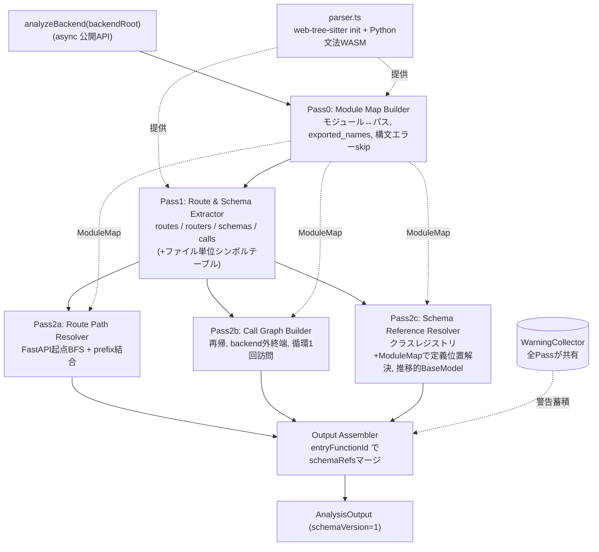
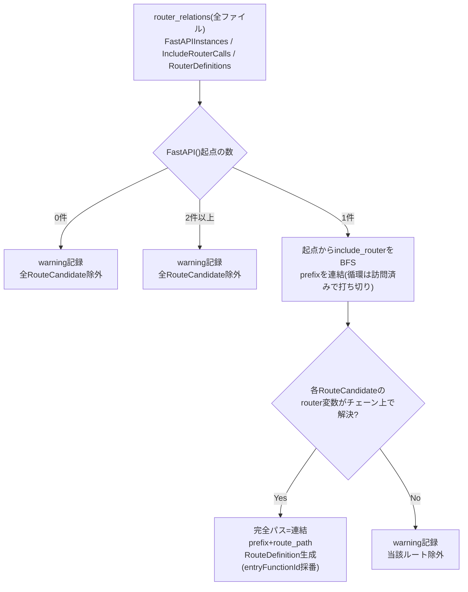
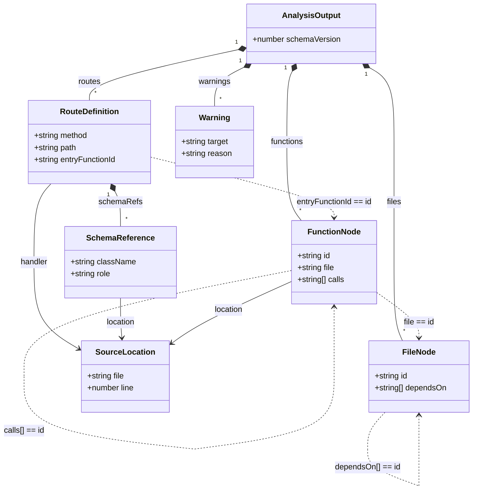

# Design Document

## Overview

**Purpose**: Backend Route Extractorは、対象プロジェクトの`backend/`配下のFastAPI(Python)ソースコードを静的解析し、ルート定義(HTTPメソッド・完全URLパス・ハンドラ)、スキーマ参照(リクエスト/レスポンスのPydanticモデル)、ハンドラ起点のファイル単位・関数単位の呼び出しグラフを、単一の`AnalysisOutput`構造化データとして生成する。

**Users**: route-linkage-engine(連携マッチング)と vscode-extension-ui(3階層グラフ可視化)が、本抽出器の出力を入力契約として利用する。

**Impact**: 本機能は当初Python(libcst)CLIとして設計されたが、「拡張機能を導入するだけで全OS動作する/外部ランタイム不要」(Requirement 6.4)の方針に合わせ、**TypeScript + web-tree-sitter(WASM)で再実装**し、VSCode拡張ホスト(Node/Electron)上でインプロセス動作させる。出力スキーマ・ID体系・抽出アルゴリズムは旧設計から保持し、解析基盤のみを置換する。

### Goals
- `backend/`配下のFastAPIルート定義(prefix結合済み完全パス含む)・スキーマ参照・呼び出しグラフ(2階層)を`AnalysisOutput`として出力する
- 拡張ホスト上でインプロセス動作し、エンドユーザーに外部の言語ランタイム/パッケージマネージャの別途インストールを要求しない
- 構文エラー等の部分的失敗があっても解析全体を継続し、除外理由を`warnings`に機械可読な形で記録する
- 出力スキーマ・ID体系を旧設計から維持し、`schemaVersion=1`の互換性を保つ

### Non-Goals
- 連携マッチング(route-linkage-engine)、UI/Webview描画(vscode-extension-ui)、frontend解析(frontend-call-extractor)
- 動的解析・対象コードの実行、デコレータ方式以外のプログラム的ルート登録(`add_api_route`等)
- `backend/`外(標準ライブラリ・外部パッケージ)への呼び出し追跡、完全な型推論
- 拡張のアクティベーション・コマンド登録・WASM配置のビルド設定(vscode-extension-ui/実装フェーズが所有)

## Boundary Commitments

### This Spec Owns
- `backend/`配下Python(FastAPI)の静的解析と、ルート/スキーマ参照/呼び出しグラフの抽出ロジック
- 出力データモデル`AnalysisOutput`(`schemaVersion=1`)とID体系(関数ID・ファイルID)の定義・安定化
- 抽出器を提供する**拡張ホスト内インプロセスTSモジュールAPI**(`analyzeBackend`)

### Out of Boundary
- 連携マッチング、UI/Webview、frontend解析(各担当spec)
- 拡張のアクティベーション・コマンド登録、VSIXへのWASM同梱を行う**ビルド/バンドル設定**(vscode-extension-uiが所有。本specはWASMロード機構=ランタイム側を提供する)

### Allowed Dependencies
- `web-tree-sitter`(WASM tree-sitterランタイム)、Python文法WASM(`@vscode/tree-sitter-wasm`由来。入手不可時は`tree-sitter-python` npm)
- 制約: ネイティブNodeアドオン(node-tree-sitter等)に依存しない。外部プロセス起動・外部ランタイムインストールを前提としない

### Revalidation Triggers
- `AnalysisOutput`スキーマ(`schemaVersion`)の変更 → route-linkage-engine / vscode-extension-ui の再検証
- web-tree-sitter / WASM ABI バージョンの更新 → 文法WASMとの整合再確認
- frontend-call-extractor との対称スキーマの変更
- 公開API(`analyzeBackend`)のシグネチャ変更 → 呼び出し側(vscode-extension-ui)の再検証

## Architecture

### Existing Architecture Analysis
旧 design.md は libcst(`MetadataWrapper`/`ScopeProvider`/`PositionProvider`/`matchers`)を前提とした Pass0–2c パイプラインを定義していた。本設計は**パイプライン構造・出力スキーマ・ID体系・抽出アルゴリズムを保持**し、libcst固有の解析基盤のみを web-tree-sitter へ置換する。保持する不変点と置換点を以下に明示する。

**置換点(libcst → web-tree-sitter)**:

| libcst | 役割 | web-tree-sitter での代替 |
|--------|------|--------------------------|
| `parse_module()` / 例外送出 | 構文解析・構文エラー検出 | `parser.parse(src)`(例外を投げない)+ `tree.rootNode.hasError` で構文エラー判定 |
| `MetadataWrapper`+`PositionProvider` | 行番号メタデータ | `node.startPosition.row`(**0基底**)。`SourceLocation.line`は1基底のため **+1** |
| `ScopeProvider` | ファイル内シンボル解決 | **自前のファイル単位シンボルテーブル**(import/class/関数のトップレベル走査) |
| `matchers`(宣言的DSL) | デコレータ・呼び出し等の形状判定 | tree-sitter **Query(S式)** + 手書きノード走査 |
| `SimpleString.evaluated_value` | 文字列リテラルのクオート除去 | `stripStringLiteral(node.text)`(`'`,`"`,`"""`,r/b/f接頭辞対応) |

### Architecture Pattern & Boundary Map

逐次パイプライン(Pipeline / Pass)パターンを採用。Pass0が全IDの source of truth となり、Pass1で各ファイルを1パス抽出、Pass2a/2b/2cでクロスファイル解決、Assemblerで統合する。



**Architecture Integration**:
- 選択パターン: 逐次パイプライン(各Passは純粋関数的、副作用は`WarningCollector`への記録のみ)
- 境界分離: Pass0=ID/モジュール解決の真実源、Pass1=ファイル内抽出、Pass2x=クロスファイル解決、Assembler=統合のみ
- 保持パターン: 出力エッジリスト表現(`calls[]`/`dependsOn[]`)で循環参照を回避、ハンドラID一致でschemaRefsマージ
- steering準拠: `tech.md`の「拡張ホスト上でインプロセス動作・外部ランタイム不要・web-tree-sitter採用」に整合

### Technology Stack

| Layer | Choice / Version | Role in Feature | Notes |
|-------|------------------|-----------------|-------|
| 公開API / 実行 | TypeScript(strict)/ Node(拡張ホスト) | `analyzeBackend`をインプロセス提供 | 外部プロセス無し。`any`不使用 |
| 解析基盤 | web-tree-sitter `^0.25.x` | Pythonソースのパース・AST走査 | 0.26はWASM ABI非互換のため不可 |
| 文法 | Python文法WASM(`@vscode/tree-sitter-wasm`、代替 `tree-sitter-python`) | `tree-sitter-python.wasm` | core v0.25系pinとABI整合 |
| WASM配置 | 拡張同梱`.wasm`(`tree-sitter.wasm`+`tree-sitter-python.wasm`) | `Language.load(絶対パス)` | 拡張は`context.extensionUri`由来、Nodeはnode_modules由来 |
| テスト | vitest | 単体/統合/E2E | `tests/fixtures/sample_app`(Python source)を入力に流用 |

> web-tree-sitter版固定・WASM ABI整合・ScopeProvider代替の詳細根拠は`research.md`参照。

## File Structure Plan

### Directory Structure
```
src/backend-analysis/                # 本specのTSモジュール(Python資産 src/apivista_backend_analysis/ とは別階層で共存)
├── index.ts            # 公開API: analyzeBackend(backendRoot): Promise<AnalysisOutput>
├── parser.ts           # web-tree-sitter init + Python文法WASMロード(wasmDir locator: 拡張/Node両対応, シングルトン)
├── ids.ts              # makeFunctionId(moduleDottedPath, qualname) / makeFileId(backendRoot, filePath)
├── models.ts           # 出力TS interface 群 + SCHEMA_VERSION=1 + 型ガード
├── warnings.ts         # WarningCollector(record / recordParseError)
├── astUtils.ts         # ノード走査ヘルパ: line(node)=row+1, stripStringLiteral, fieldChild, hasSyntaxError, computeQualname
├── moduleMap.ts        # Pass0: ModuleMap構築 + isInternalModule
├── symbolTable.ts      # ファイル単位シンボルテーブル(ScopeProvider代替): name -> local ClassDef位置 | import完全修飾名 | builtin
├── extractors/
│   ├── routes.ts       # Pass1: ルートデコレータ抽出(method/path/handler, 未解決は警告)
│   ├── routers.ts      # Pass1: APIRouter定義 / include_router / FastAPI()インスタンス
│   ├── schemas.ts      # Pass1: スキーマ参照候補 + トップレベルクラス定義レジストリ(symbolTable利用)
│   └── calls.ts        # Pass1: ハンドラ本体内の呼び出し式
├── resolver/
│   ├── routePaths.ts   # Pass2a: FastAPI起点BFS + prefix結合で完全パス算出
│   ├── callGraph.ts    # Pass2b: 関数単位グラフ再帰構築 → ファイル単位グラフ導出
│   └── schemaRefs.ts   # Pass2c: 候補をModuleMap+レジストリで定義位置解決, 推移的BaseModel判定
├── assemble.ts         # Output Assembler: 各Pass結果をAnalysisOutputへ統合
├── extractFile.ts      # Pass1統合: 1ファイルに対しroutes/routers/schemas/callsをまとめFileExtractionResult化
└── cli.ts              # 任意: 開発/デバッグ用 薄いNode CLIラッパ(stdout=JSON単一オブジェクト)
src/backend-analysis/__tests__/      # vitest 単体/統合/E2E
assets/wasm/                          # 同梱する .wasm(ビルド時node_modulesからコピー。配置詳細はvscode-extension-ui/実装が所有)
```

### Modified Files
- `package.json` — `web-tree-sitter`(^0.25)・文法WASM依存・`vitest`スクリプト追加(**/kiro-impl 実装フェーズで実施**。本designでは追加しない)
- `vitest.config.ts` — 新規(/kiro-impl)
- `src/apivista_backend_analysis/**`(Python資産)・Pythonテスト・`pyproject.toml` — TSスキャフォルド完成後に削除(/kiro-impl)。`tests/fixtures/sample_app/**`は解析INPUTのため**温存**

> 各ファイルは単一責務。`extractors/*`は同一の走査基盤(astUtils)を共有し、`resolver/*`はModuleMapとPass1結果を入力に取る。

## System Flows

ルートパス解決(Pass2a)の中核フロー(FastAPI起点の一意特定とprefix結合):



- 起点の数が1でない場合は構成が静的に確定できないため全ルート除外(Requirement 5.2/5.3)。
- `include_router`の`router_expr`(例:`items.router`)はドット式文字列で保持し、ModuleMap/変数束縛で対応する`RouterDefinition`へ解決する。

## Requirements Traceability

| Requirement | Summary | Components | Interfaces | Flows |
|-------------|---------|------------|------------|-------|
| 1.1 | ルートデコレータからmethod/path/handler抽出 | extractors/routes | `extractRoutes` | — |
| 1.2 | include_routerのprefix結合で完全パス | extractors/routers, resolver/routePaths | `extractRouterRelations`,`resolveRoutePaths` | RoutePath Flow |
| 1.3 | 複数ファイルのrouterチェーン解決 | moduleMap, resolver/routePaths | `resolveRoutePaths` | RoutePath Flow |
| 1.4 | デコレータ方式以外は対象外 | extractors/routes | `extractRoutes`(HTTPメソッド集合限定) | — |
| 2.1 | リクエスト/レスポンスモデルのクラス名・定義位置 | extractors/schemas, resolver/schemaRefs | `extractSchemaInfo`,`resolveSchemaRefs` | — |
| 2.2 | モデル型なしはschemaRefs空 | resolver/schemaRefs, assemble | `resolveSchemaRefs` | — |
| 3.1 | ハンドラ起点の関数単位呼び出しグラフ | extractors/calls, resolver/callGraph | `extractCalls`,`buildCallGraph` | — |
| 3.2 | 関数単位→ファイル単位グラフ導出 | resolver/callGraph | `deriveFileGraph` | — |
| 3.3 | backend外呼び出しは終端 | moduleMap, resolver/callGraph | `isInternalModule`,`buildCallGraph` | — |
| 4.1 | 全結果を単一データセット出力 | assemble | `assembleOutput` | — |
| 4.2 | 3階層相互参照 | ids, assemble | `makeFunctionId`,`makeFileId` | — |
| 4.3 | 各エンティティをソース位置に関連付け | astUtils, 全extractor | `SourceLocation` | — |
| 5.1 | 構文エラーファイルをskip継続 | moduleMap, warnings | `buildModuleMap`,`recordParseError` | — |
| 5.2 | 静的解決不能パスは除外 | extractors/routes, resolver/routePaths | `extractRoutes`,`resolveRoutePaths` | RoutePath Flow |
| 5.3 | 除外理由を警告に記録 | warnings(全Pass) | `WarningCollector.record` | — |
| 6.1 | backend/配下Pythonのみ解析 | moduleMap | `buildModuleMap` | — |
| 6.2 | 対象コードを実行しない(静的のみ) | parser, 全Pass | `analyzeBackend` | — |
| 6.3 | 対象依存パッケージのインストール不要 | moduleMap(ベストエフォート解決) | `analyzeBackend` | — |
| 6.4 | 外部ランタイムの別途インストール不要 | parser(WASM同梱), index | `analyzeBackend` | — |

## Components and Interfaces

| Component | Layer | Intent | Req Coverage | Key Dependencies | Contracts |
|-----------|-------|--------|--------------|------------------|-----------|
| index(`analyzeBackend`) | API | パイプライン起動・統合 | 4, 6 | parser, 全Pass | Service |
| parser | 解析基盤 | WASM init + Python文法ロード | 6.2,6.4 | web-tree-sitter | Service |
| moduleMap(Pass0) | 解析 | モジュール↔パス・公開名・構文エラーskip | 1.3,3.3,5.1,6.1 | parser, warnings | Service |
| extractFile(Pass1) | 抽出 | 1ファイル抽出統合 | 1,2,3,5 | extractors/*, symbolTable | Service |
| resolver/routePaths(2a) | 解決 | FastAPI起点BFS+prefix結合 | 1.2,1.3,5.2,5.3 | moduleMap | Service |
| resolver/callGraph(2b) | 解決 | 呼び出しグラフ構築/導出 | 3.1,3.2,3.3 | moduleMap | Service |
| resolver/schemaRefs(2c) | 解決 | スキーマ参照の定義位置解決 | 2.1,2.2,5.3 | moduleMap | Service |
| assemble | 統合 | AnalysisOutput生成 | 4.1,4.2,4.3 | ids | Service |

### API Layer

#### index — `analyzeBackend`

| Field | Detail |
|-------|--------|
| Intent | backendRootを受け取り、Pass0–2cとAssemblerを順に実行して`AnalysisOutput`を返す |
| Requirements | 4.1, 4.2, 4.3, 6.2, 6.3, 6.4 |

**Responsibilities & Constraints**
- 非同期(WASM初期化のため)。対象コードを実行せず静的解析のみ
- 解析自体が実行できた場合は`warnings`を含んでも正常完了(throwしない)。引数不正(存在しない/ディレクトリでない)はErrorをthrow

**Contracts**: Service [x]

##### Service Interface
```typescript
interface AnalyzeOptions {
  /** Python文法WASMの所在ディレクトリ。拡張は context.extensionUri 由来、未指定時はNode解決(node_modules)。 */
  wasmDir?: string;
}

/** backendRoot配下のFastAPIコードを静的解析し AnalysisOutput を返す。 */
export function analyzeBackend(
  backendRoot: string,
  options?: AnalyzeOptions,
): Promise<AnalysisOutput>;
```
- Preconditions: `backendRoot`は存在するディレクトリ。Python文法WASMがロード可能
- Postconditions: `schemaVersion=1`の単一`AnalysisOutput`。部分的失敗は`warnings`に記録
- Invariants: 同一入力に対し決定的な出力(ファイル走査順は昇順ソートで固定)

#### parser — web-tree-sitterブートストラップ

**Contracts**: Service [x]
```typescript
/** Parser.init() と Python文法ロードをプロセス内で一度だけ行い、再利用するパーサを返す。 */
export function getPythonParser(wasmDir?: string): Promise<import("web-tree-sitter").Parser>;
```
- 実装: `Parser.init()` → `Language.load(<wasmDir>/tree-sitter-python.wasm)` → `parser.setLanguage(lang)`。Parser/Languageはモジュールスコープでキャッシュ
- `wasmDir`未指定時はNode解決でnode_modules内のWASMを探索。拡張からは`context.extensionUri`由来の絶対パスを渡す(同梱WASM)

### 解析 / 抽出 Layer

#### moduleMap(Pass0)
| Field | Detail |
|-------|--------|
| Intent | `backend/`配下`.py`を走査しモジュールマップ・公開名を構築、構文エラーはskip+警告 |
| Requirements | 1.3, 3.3, 5.1, 6.1 |

**Contracts**: Service [x]
```typescript
interface ModuleMap {
  moduleToPath: Map<string, string>;   // "sample_app.routers.items" -> "routers/items.py"(fileId)
  pathToModule: Map<string, string>;   // fileId -> dotted module
  exportedNames: Map<string, Set<string>>; // module -> 公開トップレベル名(class/def/import束縛名)
}
export function buildModuleMap(backendRoot: string, collector: WarningCollector, wasmDir?: string): Promise<ModuleMap>;
export function isInternalModule(map: ModuleMap, moduleName: string): boolean;
```
- モジュール名規則: fileId(backendRoot相対POSIX)の`.py`除去→`/`を`.`化、`__init__`は末尾セグメント削除、先頭に`basename(backendRoot)`をルートセグメントとして付与(例:`routers/items.py`→`sample_app.routers.items`)
- `isInternalModule`: `moduleName`またはその祖先パッケージが`moduleToPath`に存在すればtrue
- 構文エラー判定: `tree.rootNode.hasError`がtrueなら`collector.recordParseError(fileId, ...)`して当該ファイルをスキップ(マップに加えない)

> **ID非対称性の注意**: `moduleToPath`のドット表記は`backendRoot`のbasenameをルートに含む(`sample_app.routers.items`)が、`makeFileId`はこれを含まない相対パス(`routers/items.py`)を返す。両者は文字列変換ではなく`ModuleMap`のルックアップで相互対応させること。

#### extractFile(Pass1)
| Field | Detail |
|-------|--------|
| Intent | パース成功した1ファイルから routes/routers/schemas/calls を1パス抽出 |
| Requirements | 1.1, 1.4, 2.1, 5.2, 5.3 |

**Contracts**: Service [x]
```typescript
type HttpMethod = "GET" | "POST" | "PUT" | "DELETE" | "PATCH";

interface RouteCandidate { method: HttpMethod; path: string; handlerName: string; qualname: string; location: SourceLocation; }
interface RouterDefinition { variableName: string; prefix: string; location: SourceLocation; }
interface FastAPIInstance { variableName: string; location: SourceLocation; }
interface IncludeRouterCall { targetName: string; routerExpr: string; prefix: string; location: SourceLocation; }
interface SchemaRefCandidate { role: "request" | "response"; className: string; handlerQualname: string;
  localLocation: SourceLocation | null;   // ローカル定義時
  importedQualifiedName: string | null;   // import由来時
}
interface ClassDefinition { className: string; baseClassNames: string[]; location: SourceLocation; }
interface CallExpression { callerQualname: string; calleeName: string; location: SourceLocation; } // calleeはドット式可
interface FunctionDefinitionEntry { name: string; qualname: string; location: SourceLocation; } // 当該ファイルの全関数/メソッド定義(Pass2bのcallee解決索引)

interface FileExtractionResult {
  fileId: string;
  skipped: boolean;
  routes: RouteCandidate[];
  routers: RouterDefinition[];
  fastapiInstances: FastAPIInstance[];
  includeRouterCalls: IncludeRouterCall[];
  schemaRefCandidates: SchemaRefCandidate[];
  classDefinitions: ClassDefinition[];
  functionDefinitions: FunctionDefinitionEntry[];
  callExpressions: CallExpression[];
}
export function extractFile(fileId: string, tree: Tree, map: ModuleMap, collector: WarningCollector): FileExtractionResult;
```
**抽出ルール(保持)**:
- ルートデコレータ: `@<obj>.<method>(...)`で`<method>∈{get,post,put,delete,patch}`のみ候補化(`add_api_route`等は非対象=1.4)。第1引数が文字列リテラルならクオート除去してpath確定、それ以外/無引数は候補化せず`collector.record`(5.2/5.3)。methodは大文字化して保持
- router関係: `<name>=APIRouter(prefix=...)`、`<name>=FastAPI(...)`、`<obj>.include_router(<routerExpr>, prefix=...)`を抽出。`routerExpr`はドット式文字列で保持。非リテラルprefixは`""`(警告はPass2aで)
- スキーマ参照: ハンドラ(=ルートデコレータを持つ関数)の引数アノテーション→`role:"request"`(モデル型引数ごと)、戻り値アノテーション→`role:"response"`。`symbolTable`でローカルClassDef(→localLocation)かimport(→importedQualifiedName)か判定。builtin(int/str/float/bool/dict/list/...)は候補化しない。Subscript/Attribute型注釈は除外
- クラス定義レジストリ: トップレベルClassDefのクラス名・基底クラス名(Name/Attributeのみ)・定義位置を収集
- **関数定義レジストリ**: 当該ファイルの全`function_definition`(トップレベル関数・クラスメソッド・ネスト関数)について `name`・`qualname`(=`computeQualname`)・定義位置を収集。Pass2bがクロスファイルでcalleeをFunctionNode idへ解決するための索引
- 呼び出し式: ハンドラ本体内の`call`式のcallee名(ドット式可)と呼び出し元の`callerQualname`(=`computeQualname`)を収集(Pass2bの中間データ)

#### symbolTable(ScopeProvider代替)
```typescript
type Binding =
  | { kind: "localClass"; location: SourceLocation }
  | { kind: "import"; qualifiedName: string }
  | { kind: "builtin" }
  | { kind: "other" };
/** ファイルのトップレベル import / class / def を走査し name->binding を構築。 */
export function buildSymbolTable(tree: Tree, fileId: string): Map<string, Binding>;
```

### 解決 Layer

#### resolver/routePaths(Pass2a)
**Contracts**: Service [x]
```typescript
export function resolveRoutePaths(
  perFile: Map<string, FileExtractionResult>, map: ModuleMap, collector: WarningCollector,
): RouteDefinition[];
```
- 全`fastapiInstances`を集約し起点が一意か判定(0/複数は警告+全ルート除外=5.2/5.3)
- 起点から`includeRouterCalls`をBFSし、`routerExpr`→対応`RouterDefinition`(変数束縛/ModuleMap)を解決しつつprefixを連結。循環は訪問済み集合で打ち切り
- 各`RouteCandidate`の完全パス=連結prefix+候補path。解決できないルートは警告+除外
- `entryFunctionId = makeFunctionId(moduleDottedPath(fileId), candidate.qualname)`

#### resolver/callGraph(Pass2b)
**Contracts**: Service [x]
```typescript
export function buildCallGraph(
  entryHandlers: RouteCandidate[], perFile: Map<string, FileExtractionResult>, map: ModuleMap,
): FunctionNode[];
export function deriveFileGraph(functions: FunctionNode[]): FileNode[];
```
**callee → FunctionNode id 解決手順**(クロスファイル。`functionDefinitions`レジストリと`symbolTable`を使用):
1. 全ファイルの`functionDefinitions`を、所属モジュールのドット表記でキー化した検索索引にする(`(moduleDottedPath, qualname) → location`、id は `makeFunctionId`)。
2. `callExpressions[].calleeName` を呼び出し元ファイルの文脈で解決:
   - **単純名**(`format_item_label`): 呼び出し元ファイルの`symbolTable`を引く。`import`束縛なら `importedQualifiedName` の先頭をモジュール、末尾を関数名とみなし、`ModuleMap`で内部モジュールへ解決→当該モジュールの`functionDefinitions`から一致する `name` を特定して id 化。同一ファイルのローカル定義(`functionDefinitions`に存在)ならそのまま id 化。
   - **ドット式**(`obj.method` / `self.x.y`): 属性アクセス経由はベストエフォート。レシーバの型が静的に特定できないため、`functionDefinitions`に一意一致する関数名が無ければ**終端**として扱い`calls`に含めない。
3. `isInternalModule(map, ...)`がfalse、または索引に一致が無いcalleeは**終端**(外部呼び出し=callsに含めない=3.3)。
- ハンドラを起点にDFS。同一関数IDは1回のみ訪問(循環でも無限再帰しない)。`FunctionNode.calls`はbackend内呼び出し先IDの配列(重複排除)
- `deriveFileGraph`: 各関数の`file`から、呼び出し先の`file`集合を`FileNode.dependsOn`に集約(自己依存は除外)

#### resolver/schemaRefs(Pass2c)
**Contracts**: Service [x]
```typescript
export function resolveSchemaRefs(
  perFile: Map<string, FileExtractionResult>, map: ModuleMap, collector: WarningCollector,
): Map<string, SchemaReference[]>; // key = handler functionId
```
- 全ファイルのクラス定義を完全修飾名でレジストリ化。import由来候補はModuleMapでファイル解決しレジストリから定義位置を特定
- `BaseModel`継承判定: 直接基底が`BaseModel`、またはレジストリ内で基底を辿って到達できる場合に確定。レジストリ外(外部基底)到達で打ち切り(ベストエフォート)、循環は訪問済みで打ち切り
- `BaseModel`に到達したもののみ`SchemaReference`化。解決不能候補は警告(5.3)。型注釈なしのハンドラはキー自体が空(2.2)
- 出力キー(handler functionId)は`entryFunctionId`と同値 → Assemblerでマージ可能

#### assemble — Output Assembler
**Contracts**: Service [x]
```typescript
export function assembleOutput(
  routes: RouteDefinition[], schemaRefsByHandler: Map<string, SchemaReference[]>,
  functions: FunctionNode[], files: FileNode[], warnings: Warning[],
): AnalysisOutput;
```
- `routes[].schemaRefs`を`entryFunctionId`一致で`schemaRefsByHandler`からマージ(該当なしは空配列=2.2)
- `schemaVersion`を付与し、`routes/functions/files/warnings`を統合(4.1/4.2/4.3)

## Data Models

### Data Contracts & Integration（出力スキーマ：route-linkage-engine / vscode-extension-ui の入力契約）

JSON キー名・型・必須性は旧設計から不変。`schemaVersion=1`。

構造と**参照貫通(実装の不変条件)**を図示する。`..>` は値による参照(IDが一致すること)を表す。



```typescript
export const SCHEMA_VERSION = 1 as const;

export interface SourceLocation { file: string; line: number; }          // file=backendRoot相対POSIX, line=1基底
export interface Warning { target: string; reason: string; }
export interface SchemaReference { className: string; location: SourceLocation; role: "request" | "response"; }

export interface RouteDefinition {
  method: string;          // "GET" | "POST" | "PUT" | "DELETE" | "PATCH"
  path: string;            // prefix結合済みの完全URLパス
  handler: SourceLocation;
  entryFunctionId: string; // "<module-dotted-path>:<qualname>"
  schemaRefs: SchemaReference[];
}
export interface FunctionNode {
  id: string;              // "<module-dotted-path>:<qualname>"
  name: string;
  file: string;            // fileId(backendRoot相対POSIX)
  location: SourceLocation;
  calls: string[];         // 呼び出し先FunctionNode.id（backend外は含めない）
}
export interface FileNode { id: string; path: string; dependsOn: string[]; } // id===path（fileId）
export interface AnalysisOutput {
  schemaVersion: number;   // = 1
  routes: RouteDefinition[];
  functions: FunctionNode[];
  files: FileNode[];
  warnings: Warning[];
}
```

**ID体系**:
- `makeFunctionId(moduleDottedPath, qualname)` → `"<module-dotted-path>:<qualname>"`(例 `sample_app.routers.items:get_item`、メソッドは`Class.method`)
- `makeFileId(backendRoot, filePath)` → backendRoot相対POSIXパス(例 `routers/items.py`)
- `entryFunctionId` = `FunctionNode.id` = Pass2c出力キーが同一ハンドラで一致すること（整合性の要）

**qualname 構築規則**(`astUtils.computeQualname`、ID決定性の前提):
- tree-sitter には qualname provider が無いため、対象の `function_definition` ノードから**祖先方向**に `class_definition` / `function_definition` を辿り、各祖先の `name` を外側→内側の順に `.` で連結し、末尾に自身の関数名を付す。
  - トップレベル関数 `def get_item` → `"get_item"`
  - クラス内メソッド `class ItemRouter: def get_item` → `"ItemRouter.get_item"`
  - ネスト関数 `def outer: def inner` → `"outer.inner"`
- `module` / 条件分岐(if 等)ノードは qualname セグメントに含めない(`class_definition`/`function_definition` のみが境界)。
- Pass1 で抽出する `RouteCandidate.qualname`・`functionDefinitions[].qualname`・呼び出し元 `callerQualname` はすべて本規則で算出し、`makeFunctionId` に渡すことで Pass1/2a/2b/2c のハンドラIDが一致する。

**整合性の要点**:
- `SourceLocation.file`・`FunctionNode.file`・`FileNode.id`・`FileNode.path`は同一のbackendRoot相対POSIX表現で揃える
- 呼び出しグラフはネスト構造ではなくエッジリスト(`calls[]`/`dependsOn[]`)で表現し循環参照を回避

## Error Handling

### Error Strategy
- **部分的失敗は継続**: ファイル単位の構文エラー・ルートのパス未解決・スキーマ参照の解決不能は、当該要素を結果から除外し`Warning{target, reason}`に記録して処理を継続する（throwしない）。
- **致命的エラーのみthrow**: `backendRoot`が存在しない/ディレクトリでない、Python文法WASMがロードできない等、解析自体が成立しない場合のみ`analyzeBackend`がErrorをthrowする。

### Error Categories and Responses
- **入力エラー**: 不正な`backendRoot` → Errorをthrow（呼び出し側=拡張がユーザーへ通知）
- **構文エラー(対象コード)**: `tree.rootNode.hasError` → 当該ファイルskip + `recordParseError`（5.1）
- **静的解決不能**: 動的パス/FastAPI起点不定/スキーマ未解決 → 当該要素除外 + `warning`（5.2/5.3）

### Monitoring
- `warnings`配列が機械可読な診断出力を兼ねる。CLIラッパ使用時はログをstderr、`AnalysisOutput` JSONをstdoutに分離。

## Testing Strategy

### Unit Tests
- `ids`: 同一入力で決定的、`makeFunctionId`/`makeFileId`の規則（5.2 ID整合の基盤、4.2）
- `moduleMap`: sample_appのモジュール↔パス対応、`broken.py`をskipし警告1件（5.1, 6.1）
- `extractors/routes`: `/{item_id}`・`""`確定、`get_dynamic_item`は未解決→警告（1.1, 1.4, 5.2, 5.3）
- `extractors/routers`: `app`=FastAPI起点、include_router（items prefix `/api` / users prefix `""`）、APIRouter prefix `/items`,`/users`（1.2, 1.3）
- `extractors/schemas`: ローカル`ItemCreate`/`ItemResponse`の定義位置、import`UserRequest`/`UserResponse`の完全修飾名+role、`format_item_label`は非ハンドラで候補なし（2.1）

### Integration Tests
- `resolver/routePaths`: `/api/items/{item_id}`・`/users`の完全パス、起点0/複数件で全除外+警告（1.2, 1.3, 5.2, 5.3）
- `resolver/callGraph`: `get_item`→`format_item_label`エッジ、外部(`fastapi`等)呼び出し終端、循環1回訪問、ファイルグラフ導出（3.1, 3.2, 3.3）
- `resolver/schemaRefs`: 別ファイル`UserRequest`/`UserResponse`のlocation/role解決、型注釈なしは空、推移的BaseModel（2.1, 2.2, 5.3）

### E2E Tests
- `analyzeBackend(sample_app)`: 単一`AnalysisOutput`（schemaVersion=1）、`entryFunctionId→functions[].id→functions[].file→files[].id`の参照貫通、`warnings`に`broken.py`構文エラーと動的ルートを含む（4.1, 4.2, 4.3）
- 外部ランタイム非依存: Node(vitest)上でWASMロードのみで完走し、Python/uvを必要としない（6.4）

## Security Considerations
- 対象コードを実行しない静的解析のみ（任意コード実行リスクなし、6.2）。ファイル読み取りは`backendRoot`配下に限定（6.1）。WASMはサンドボックス内で動作。
