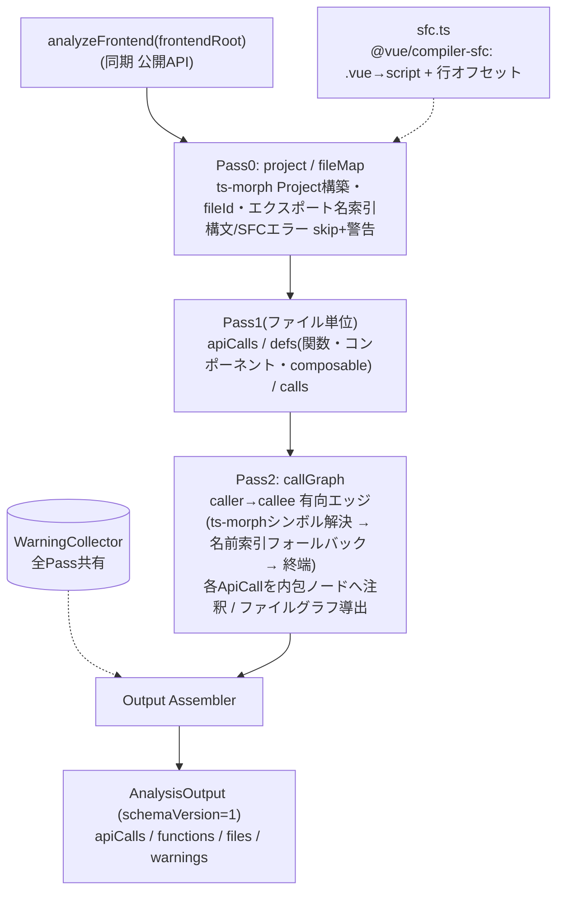
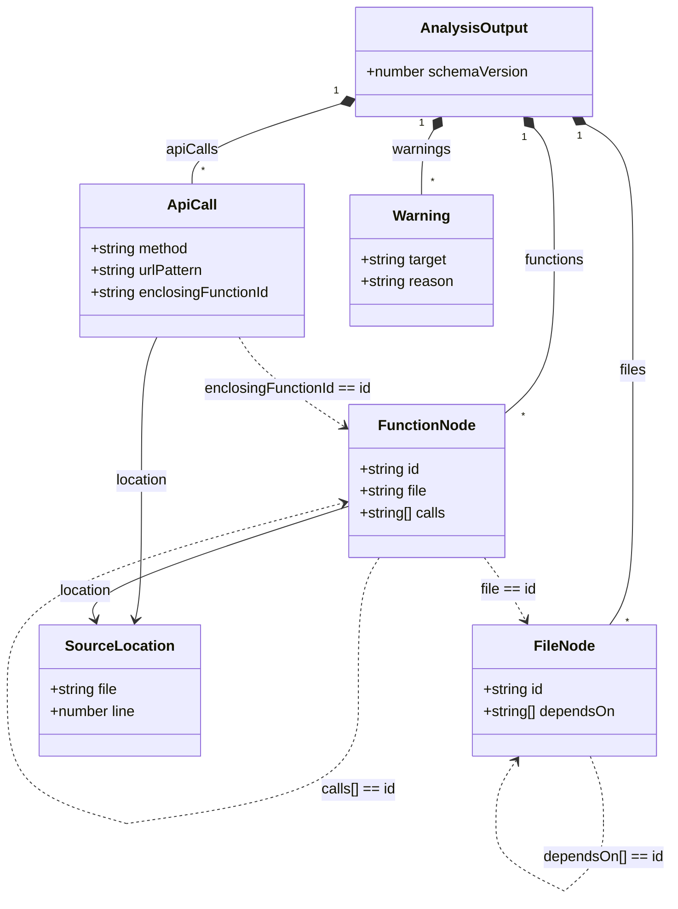

# Design Document

## Overview

**Purpose**: Frontend Call Extractorは、対象プロジェクトの `frontend/` 配下の Nuxt.js(Vue3/TS/JS)ソースを静的解析し、API呼び出し(HTTPメソッド・URLパターン・内包ノード・位置)と、`frontend/` 内の有向呼び出しグラフ(関数/コンポーネント/composable 単位 + ファイル単位)を、単一の `AnalysisOutput` として生成する。

**Users**: route-linkage-engine(URL静的マッチング+OpenAPI照合の連携付け)と vscode-extension-ui(3階層可視化)が、本抽出器の出力を **backend-route-extractor と対称的なスキーマの入力契約**として利用する。

**Impact**: backend-route-extractor で確立した Pass0→Pass1→Pass2→Assemble パイプライン・出力スキーマ・ID体系・エッジリスト方式を**対称的に流用**し、解析基盤のみ Python(web-tree-sitter)から **TypeScript/Vue(ts-morph + @vue/compiler-sfc)** へ置き換える。全構成が拡張ホスト(Node/Electron)上でインプロセス動作し、エンドユーザーに外部ランタイムを要求しない。

### Goals
- `frontend/` の API呼び出し(`$fetch`/`useFetch`/axios 等)を method・URLパターン(動的セグメントはプレースホルダ正規化)・内包ノード・位置として抽出する
- API呼び出しを内包ノードに注釈した、`frontend/` 内の有向呼び出しグラフ(関数単位・ファイル単位)を構築する
- backend と対称的な `AnalysisOutput`(`schemaVersion=1`)を出力し、参照貫通の不変条件を保つ
- 拡張ホスト上でインプロセス動作し、外部ランタイム/ネイティブモジュール再ビルドを要求しない

### Non-Goals
- 連携マッチング(route-linkage-engine)、UI/Webview(vscode-extension-ui)、backend解析(backend-route-extractor)
- baseURL/相対URLの prefix 補完・正規化(route-linkage-engine が担当)
- リクエスト/レスポンスのボディ型(スキーマ)抽出、動的解析・実行時トレース
- 認識対象パターン以外のプログラム的 HTTP クライアント呼び出し、`frontend/` 外への呼び出し追跡

## Boundary Commitments

### This Spec Owns
- `frontend/` 配下 Vue/TS/JS の静的解析と、API呼び出し・呼び出しグラフの抽出ロジック
- 出力データモデル `AnalysisOutput`(`schemaVersion=1`)— backend と対称的な構造の定義
- 抽出器を提供する拡張ホスト内インプロセス TS モジュール API(`analyzeFrontend`)

### Out of Boundary
- 連携マッチング、UI/Webview、backend解析(各担当spec)
- baseURL/相対URLの正規化(route-linkage-engine)— 本抽出器は呼び出し位置のURLパターンをそのまま提供
- 拡張のアクティベーション・コマンド登録・バンドル設定(vscode-extension-ui)

### Allowed Dependencies
- `ts-morph`(既存依存 `^23`): TS/JS の AST 解析・シンボル/参照解決
- `@vue/compiler-sfc`(新規): `.vue` から `<script>`/`<script setup>` ブロック抽出
- 制約: ネイティブNodeアドオンやWASM・外部プロセス・外部ランタイムインストールに依存しない(いずれも純JS、拡張ホストでインプロセス動作)

### Revalidation Triggers
- `AnalysisOutput` スキーマ(`schemaVersion`)の変更 → route-linkage-engine / vscode-extension-ui の再検証
- backend-route-extractor との対称スキーマの変更 → route-linkage-engine の再検証
- `ts-morph` / `@vue/compiler-sfc` のメジャー更新 → 解析・SFC抽出の再確認
- 公開API `analyzeFrontend` のシグネチャ変更 → 呼び出し側(vscode-extension-ui)の再検証

## Architecture

### Existing Architecture Analysis（backend-route-extractor からの対称流用）
backend は Pass0(Module Map)→Pass1(抽出)→Pass2(クロスファイル解決)→Assemble の逐次パイプラインで、出力をエッジリスト(`calls[]`/`dependsOn[]`)で表現し、ID整合(`entryFunctionId == FunctionNode.id`)を保証した。本設計はこの構造・スキーマ・ID体系を保持し、解析基盤と「クロスファイル名前解決」の具体手段のみ frontend 向けに置換する。

**置換点(backend[web-tree-sitter] → frontend[ts-morph/@vue/compiler-sfc])**:

| backend | 役割 | frontend での対応 |
|---------|------|--------------------|
| web-tree-sitter `parse()` | Python パース | `.ts/.js` は ts-morph、`.vue` は @vue/compiler-sfc でスクリプト抽出→ts-morph |
| `rootNode.hasError` | 構文エラー検出 | ts-morph の構文診断 / @vue/compiler-sfc の `parse().errors` |
| 自前 `symbolTable` + 相対import解決 | クロスファイル名前解決 | **ts-morph のシンボル/参照解決**(明示import)+ **エクスポート名索引フォールバック**(Nuxt auto-import) |
| `startPosition.row`(0基底)+1 | 位置 | ts-morph は1基底。`.vue` は **scriptブロック開始行のオフセット補正** が必要 |
| ModuleMap(dotted, basename付き) | モジュール↔ファイル | fileId(frontendRoot相対POSIX)+ エクスポート名索引 |

### Architecture Pattern & Boundary Map

逐次パイプライン。Pass0 が ts-morph Project と fileId/名前索引を確立、Pass1 がファイル単位抽出、Pass2 がクロスファイル解決(ts-morph シンボル解決 + auto-import フォールバック)、Assemble が統合する。



**Architecture Integration**:
- 選択パターン: 逐次パイプライン(各Passは純粋関数的、副作用は `WarningCollector` のみ)
- 境界分離: Pass0=Project/ID/名前索引、Pass1=ファイル内抽出、Pass2=クロスファイル解決、Assemble=統合
- 保持パターン: エッジリスト出力、内包ノード注釈による参照貫通、backend 対称スキーマ
- steering準拠: `tech.md`「frontend解析=TS+ts-morph、拡張ホストでインプロセス、外部ランタイム不要、vitest検証」に整合

### Technology Stack

| Layer | Choice / Version | Role in Feature | Notes |
|-------|------------------|-----------------|-------|
| 公開API / 実行 | TypeScript(strict)/ Node(拡張ホスト) | `analyzeFrontend` をインプロセス提供 | 外部プロセス無し。`any` 不使用。ts-morph 同期のため非async |
| TS/JS 解析 | ts-morph `^23`(既存) | `.ts/.js` の AST・シンボル/参照解決 | 純JS。Project 内クロスファイル解決を活用 |
| Vue SFC 抽出 | @vue/compiler-sfc `^3.5`(新規) | `.vue` の `<script>`/`<script setup>` 抽出 + `loc`、**及び `<template>` AST**(コンポーネント利用抽出) | 純JS。スクリプトを ts-morph に渡し、template はコンポーネント参照抽出に使う |
| テスト | vitest | 単体/統合/E2E | `tests/fixtures/sample_nuxt`(解析INPUT)を使用 |

> ts-morph/@vue/compiler-sfc 採用根拠・Nuxt auto-import・行マッピングの詳細は `research.md` 参照。

## File Structure Plan

### Directory Structure
```
src/frontend-analysis/                # 本specのTSモジュール
├── index.ts            # 公開API: analyzeFrontend(frontendRoot): AnalysisOutput(非async)
├── project.ts          # ts-morph Project 構築(.ts/.js + 仮想.ts化した.vueスクリプト)
├── sfc.ts              # @vue/compiler-sfc で .vue→scriptブロック抽出 + 行オフセット保持 + template AST 取得
├── fileMap.ts          # Pass0: fileId・エクスポート名索引・コンポーネント名索引・エイリアス(~//@/)解決
├── models.ts           # 出力TS interface 群 + SCHEMA_VERSION=1(backend と対称)
├── ids.ts              # makeFunctionId(modulePath, qualname) / makeFileId(frontendRoot, filePath)
├── warnings.ts         # WarningCollector(record / recordParseError)
├── astUtils.ts         # ノード走査・URL正規化(stripStringLiteral / normalizeUrlTemplate)・位置(行オフセット適用)
├── extractors/
│   ├── apiCalls.ts     # Pass1: $fetch/useFetch/axios 形態の検出(method/URLパターン/内包ノード/位置)
│   ├── defs.ts         # Pass1: 関数・composable・コンポーネント定義レジストリ(.vue は単一コンポーネントノード)
│   ├── calls.ts        # Pass1: 本体内の呼び出し式(caller→callee)
│   └── templates.ts    # Pass1: .vue template AST からコンポーネント参照(<Child/>)を抽出
├── resolver/
│   └── callGraph.ts    # Pass2: 有向呼び出しグラフ(ts-morph解決+名前索引)+ API注釈 + ファイルグラフ
├── assemble.ts         # Output Assembler: 各Pass結果を AnalysisOutput へ統合
└── cli.ts              # 開発/E2E用 薄いNode CLI(stdout=単一JSON / stderr=ログ)
src/frontend-analysis/__tests__/      # vitest 単体/統合/E2E
tests/fixtures/sample_nuxt/           # 新規フィクスチャ(解析INPUT)
```

### Modified Files
- `package.json` — `@vue/compiler-sfc`(^3.5)を依存追加(**/kiro-impl 実装フェーズで実施**)。ts-morph は既存
- `tests/fixtures/sample_nuxt/` — 新規作成(下記 Testing Strategy 参照)

> 各ファイルは単一責務。`extractors/*` は ts-morph ノード走査基盤(astUtils)を共有し、`resolver/callGraph.ts` は Pass1 結果 + fileMap を入力に取る。
> **共有型の扱い**: 当面 `models.ts` に backend と同形の型を自己完結で定義(完成済み backend を非改変=回帰回避)。`src/shared/` への統合は route-linkage-engine(両出力を消費)着手時の DRY 機会として将来候補。

## System Flows

呼び出し先(callee)解決フロー。**Nuxt はエイリアス(`~/`,`@/`)+ auto-import を多用し、対象 tsconfig 無し(依存未インストール, Req5.3)では ts-morph の module 解決が大半失敗する**ため、本設計では **fileMap の名前/コンポーネント名索引 + エイリアス解決を一級の解決手段**とし、ts-morph シンボル解決は精度向上の補助に位置づける。

```mermaid
flowchart TD
  C["呼び出し式 callee（識別子/属性）/ template の <Child/>"] --> A{"明示import?"}
  A -->|yes| AL["import 指定子を解決\n(~//@/ エイリアス→frontendRoot、相対→fileId)"]
  AL -->|frontend内ファイル特定| IDX
  A -->|no(auto-import)| IDX{"名前索引で一致検索\n関数/composable=exportIndex\nコンポーネント=componentIndex"}
  IDX -->|一意一致 & frontend内| ID["対象ノードの FunctionNode.id"]
  IDX -->|非一意/一致なし| T1["終端(calls に含めない)"]
  AL -->|frontend外(node_modules)| T2["終端"]
  ID --> E["caller→callee 有向エッジを追加(重複排除)"]
  ID -. 補助 .- TM["ts-morph シンボル解決で精度確認(任意)"]
```

- 関数/composable 呼び出しは `exportIndex`、template のコンポーネント参照(`<UserList/>`)は `componentIndex`(コンポーネント名→`.vue` の単一コンポーネントノード)で解決する。エイリアス `~/`/`@/` は `frontendRoot` 起点に解決。一意に定まらない/`frontend/`外/未解決は終端(Req 2.3)。
- **コンポーネント間エッジ(Issue 1 反映)**: `.vue` の `<template>` 内の子コンポーネント参照を、当該コンポーネントノード→子コンポーネントノードの有向エッジとして追加する。これにより「ページ→コンポーネント→composable→API呼び出し」の到達経路が呼び出しグラフ上で連結される(Req 2.1)。動的 `<component :is>` 等で静的に名前が定まらない場合は終端。

## Requirements Traceability

| Requirement | Summary | Components | Interfaces |
|-------------|---------|------------|------------|
| 1.1 | 認識パターンの method/URLパターン/位置抽出 | extractors/apiCalls | `extractApiCalls` |
| 1.2 | method(呼び出し名/options、既定GET) | extractors/apiCalls | `extractApiCalls` |
| 1.3 | URLパターン(テンプレートリテラル→プレースホルダ正規化) | astUtils, extractors/apiCalls | `normalizeUrlTemplate` |
| 1.4 | API呼び出しを内包ノードに関連付け | extractors/apiCalls, resolver/callGraph | `extractApiCalls`,`buildCallGraph` |
| 1.5 | 認識対象外は抽出しない | extractors/apiCalls | `extractApiCalls` |
| 2.1 | 有向呼び出しグラフ構築(関数/composable + template経由のコンポーネント間エッジ) | resolver/callGraph, extractors/templates | `buildCallGraph` |
| 2.2 | ファイル単位グラフ導出 | resolver/callGraph | `deriveFileGraph` |
| 2.3 | frontend外は終端 | fileMap, resolver/callGraph | `resolveSpecifierToFileId`,`buildCallGraph` |
| 3.1 | 単一データセット出力 | assemble | `assembleOutput` |
| 3.2 | 3階層参照・backend対称スキーマ | ids, models, assemble | `makeFunctionId`,`makeFileId` |
| 3.3 | ソース位置の関連付け | sfc, astUtils | `toSourceLocation`(行オフセット適用) |
| 4.1 | 構文/SFCエラー skip継続 | project, fileMap, warnings | `buildProject`,`recordParseError` |
| 4.2 | 動的URL/method 除外 | extractors/apiCalls | `extractApiCalls` |
| 4.3 | 除外理由を警告に記録 | warnings(全Pass) | `WarningCollector.record` |
| 5.1 | frontend/配下のみ | fileMap | `buildFileMap` |
| 5.2 | 静的解析のみ | index, project | `analyzeFrontend` |
| 5.3 | 対象依存インストール不要 | project(ベストエフォート解決) | `analyzeFrontend` |
| 5.4 | 外部ランタイム不要 | index(純JS依存) | `analyzeFrontend` |

## Components and Interfaces

| Component | Layer | Intent | Req Coverage | Contracts |
|-----------|-------|--------|--------------|-----------|
| index(`analyzeFrontend`) | API | パイプライン起動・統合 | 3,5 | Service |
| project / sfc | 解析基盤 | ts-morph Project + .vue 抽出 + 行オフセット | 3.3,4.1,5.x | Service |
| fileMap(Pass0) | 解析 | fileId・エクスポート名/コンポーネント名索引・エイリアス/外部判定 | 2.3,4.1,5.1 | Service |
| extractors/apiCalls(Pass1) | 抽出 | API呼び出し抽出 | 1.1-1.5,4.2 | Service |
| extractors/defs,calls(Pass1) | 抽出 | 定義レジストリ・呼び出し式 | 2.1 | Service |
| resolver/callGraph(Pass2) | 解決 | 有向グラフ+API注釈+ファイルグラフ | 2.1,2.2,2.3 | Service |
| assemble | 統合 | AnalysisOutput 生成 | 3.1,3.2,3.3 | Service |

### API Layer

#### index — `analyzeFrontend`
| Field | Detail |
|-------|--------|
| Intent | frontendRoot を受け取り Pass0–2 + Assemble を実行して `AnalysisOutput` を返す |
| Requirements | 3.1, 3.2, 3.3, 5.1, 5.2, 5.3, 5.4 |

**Contracts**: Service [x]
```typescript
export interface AnalyzeFrontendOptions {
  /** 解析対象拡張子の上書き等(任意)。既定は .ts/.js/.vue。 */
  include?: string[];
}
/** frontendRoot 配下を静的解析し AnalysisOutput を返す（同期）。 */
export function analyzeFrontend(frontendRoot: string, options?: AnalyzeFrontendOptions): AnalysisOutput;
```
- Preconditions: `frontendRoot` は存在するディレクトリ(不在/非ディレクトリは throw)
- Postconditions: `schemaVersion=1` の単一 `AnalysisOutput`。部分的失敗は `warnings` に記録
- Invariants: 対象コードを実行しない(静的のみ)。ts-morph/@vue/compiler-sfc は純JS で外部ランタイム不要。決定的(ファイル走査は昇順ソート)

#### sfc — Vue SFC 抽出 + 行マッピング
**Contracts**: Service [x]
```typescript
export interface ScriptSegment {
  /** 結合後スクリプト内での開始行（1基底）。 */
  fromLine: number;
  /** 結合後スクリプト内での終了行（1基底, 含む）。 */
  toLine: number;
  /** この領域が対応する .vue 実ファイルの開始行（1基底）。 */
  vueStartLine: number;
}
export interface ExtractedScript {
  /** ts-morph に渡すスクリプト本文(.ts 相当、<script>+<script setup> を結合)。 */
  content: string;
  /** 結合本文の各領域→元 .vue 行のマップ（Issue 1: 複数ブロック併存の行補正）。 */
  segments: ScriptSegment[];
  lang: "ts" | "js";
}
export interface ComponentRef {
  /** template 内で参照された子コンポーネント名（PascalCase 正規化）。 */
  name: string;
  location: SourceLocation;
}
export interface ExtractedSfc {
  script: ExtractedScript | null;
  /** <template> から抽出した子コンポーネント参照（Issue 1: コンポーネント間エッジ用）。 */
  componentRefs: ComponentRef[];
}
/** .vue ソースから script(複数ブロック結合・オフセット保持)と template のコンポーネント参照を抽出。SFCパースエラーは null script + 警告。 */
export function extractSfc(vueSource: string, fileId: string, collector: WarningCollector): ExtractedSfc;
```
- template のコンポーネント参照は kebab-case/PascalCase を PascalCase に正規化(`<user-list>`/`<UserList>` → `UserList`)。動的 `<component :is>` は静的解決対象外。
- `@vue/compiler-sfc` の `parse()` を用い、`descriptor.script`/`descriptor.scriptSetup` の `.content` と `.loc.start.line` を取得。`parse().errors` があれば `recordParseError` して `script=null` を返す(Pass0 でskip)。
- **行マッピング(Issue 1: 複数ブロック対応)**: `<script>` と `<script setup>` が併存する場合は本文を結合しつつ、各ブロックを `segments`(結合本文の行範囲→元 .vue 開始行)として保持する。`astUtils.toSourceLocation` は ts-morph 内行 `L` が属する segment を引き、`.vue` 実行番号 = `segment.vueStartLine - 1 + (L - segment.fromLine + 1)` で補正する(単一 `startLine` では併存ブロックの行がずれるため)。

### 解析 / 抽出 Layer

#### fileMap(Pass0)
**Contracts**: Service [x]
```typescript
export interface FileMap {
  /** fileId（frontendRoot相対POSIX）の集合。 */
  fileIds: Set<string>;
  /** エクスポート名 → 定義元 fileId+ノードID（関数/composable の名前解決。auto-import 対応の一級索引）。 */
  exportIndex: Map<string, { fileId: string; functionId: string }[]>;
  /** コンポーネント名(PascalCase) → .vue の単一コンポーネントノード（template の <Child/> 解決用）。 */
  componentIndex: Map<string, { fileId: string; functionId: string }[]>;
}
export function buildFileMap(frontendRoot: string, project: import("ts-morph").Project, collector: WarningCollector): FileMap;
/** import 指定子(相対 / ~/ / @/ エイリアス)を frontendRoot 起点で fileId へ解決。外部は null。 */
export function resolveSpecifierToFileId(specifier: string, currentFileId: string, fileMap: FileMap): string | null;
```
- `frontendRoot` 配下の `.ts/.js/.vue` のみ対象(Req5.1)。`.vue` は抽出済みスクリプトを仮想 `.ts` として Project に投入(`project.ts`)。
- **解決の一級手段**は `exportIndex`/`componentIndex` + エイリアス解決(`resolveSpecifierToFileId`)。`~/`/`@/` は `frontendRoot`、相対は `currentFileId` 起点で解決。ts-morph シンボル解決は精度向上の補助(Issue 3 反映)。
- `componentIndex` のキーは **Nuxt のコンポーネント auto-import 命名規約**に沿って生成する(Issue 2): `components/` 配下は**ディレクトリ接頭辞**を含めた PascalCase 名とする(`components/UserList.vue`→`UserList`、`components/base/Button.vue`→`BaseButton`、`components/user/List.vue`→`UserList`)。`components/` 外(`pages/` 等)は単純ファイル名由来。生成名は冗長セグメントの重複除去(Nuxt 準拠)を行うが、完全一致しないケースは best-effort とし、解決漏れは終端(誤エッジを作らない)。
- 構文/SFCエラーのファイルはskip+`recordParseError`(Req4.1)。

#### extractors/apiCalls(Pass1)
**Contracts**: Service [x]
```typescript
interface ApiCallCandidate {
  method: string;             // 大文字。既定 "GET"
  urlPattern: string;         // リテラル or テンプレートリテラル正規化後（例 "/api/users/{}"）
  enclosingFunctionId: string;// 内包する関数/コンポーネント/composable の FunctionNode.id
  location: SourceLocation;
}
export function extractApiCalls(sourceFile: import("ts-morph").SourceFile, fileId: string, segments: ScriptSegment[], collector: WarningCollector): ApiCallCandidate[];
```
- `segments` は `.vue` 由来の行補正に使う（`.ts/.js` は恒等=空配列で渡し、ts-morph 行をそのまま採用）。
**抽出ルール**:
- 認識対象: `$fetch(...)` / `useFetch(...)`(識別子呼び出し)、`axios.get/.post/.put/.delete/.patch(...)`(属性呼び出し)、`axios(url, { method })` / `$fetch(url, { method })`(options 形態)。これら以外は対象外(Req1.5)。
- method: 属性名(`.get`→GET)優先、無ければ options の `method` リテラル、いずれも無ければ既定 `GET`(Req1.2)。method が非リテラルで決定不能 → 当該呼び出しを除外+`collector.record`(Req4.2)。
- URL: 第1引数。文字列リテラルはそのまま、テンプレートリテラルは `astUtils.normalizeUrlTemplate` で `${expr}`→プレースホルダ(`{}`)正規化し、リテラル骨格を保持(Req1.3)。URL骨格自体が動的(変数/関数結果)でパターン化不能 → 除外+`collector.record`(Req4.2)。
- `enclosingFunctionId`: 最近傍の包含定義(関数/コンポーネント/composable)を `defs` 索引から特定(Req1.4)。
- `location`: `toSourceLocation(fileId, node, segments)` で .vue 行補正(segment 検索)を適用(Req3.3)。

#### extractors/defs, calls, templates(Pass1)
- `defs`: トップレベル関数・矢印関数の名前付き束縛・`use*` composable を `FunctionDefinitionEntry{name,qualname,location}` として収集(backend の functionDefinitions 相当)。
  - **コンポーネントノード規約(Issue 2 反映)**: 各 `.vue` は **単一のコンポーネントノード**を登録する。`qualname = <コンポーネント名>`(ファイル名由来 PascalCase。例 `components/UserList.vue`→`UserList`、`pages/users.vue`→`Users`)、`id = makeFunctionId(modulePath(fileId), qualname)`。`<script setup>`/SFC `setup()`/`<script>` のトップレベルに直接書かれた API呼び出し・呼び出し式は、名前付き関数に内包されない限り**この コンポーネントノードに帰属**する(`enclosingFunctionId` = コンポーネントノードid)。これにより `<script setup>` 直下の `useFetch(...)` も参照貫通する。
- `calls`: 各定義(関数/composable/コンポーネントノード)本体内の `CallExpression` を `{callerQualname, calleeText, location}` として収集(Pass2 の入力)。
- `templates`: `.vue` の template から子コンポーネント参照(`ComponentRef`)を収集。各参照は「当該コンポーネントノード → 子コンポーネントノード」のエッジ候補(Pass2 で `componentIndex` 解決)。

### 解決 Layer

#### resolver/callGraph(Pass2)
**Contracts**: Service [x]
```typescript
export function buildCallGraph(
  perFile: Map<string, FileExtractionResult>,
  fileMap: FileMap,
  project: import("ts-morph").Project,
): FunctionNode[];
export function deriveFileGraph(functions: FunctionNode[]): FileNode[];
```
- 各定義ノード(関数/composable/**コンポーネントノード**)を `FunctionNode{id, name, file, location, calls:[]}` 化。`id = makeFunctionId(modulePath(fileId), qualname)`。
- callee 解決(System Flows 図の通り、Issue 3 反映): ① 明示import は指定子をエイリアス/相対込みで `resolveSpecifierToFileId` → 対象ファイルの該当ノード ② import 無し(auto-import)は `fileMap.exportIndex` の名前一致 ③ `frontend/`外/未解決/非一意は終端。ts-morph シンボル解決は精度向上の補助。解決した内部呼び出し先 id を `calls` に追加(重複排除、Req2.3)。
- **コンポーネント間エッジ(Issue 1 反映)**: 各 `.vue` の `templates` の子コンポーネント参照を `fileMap.componentIndex` で解決し、当該コンポーネントノード → 子コンポーネントノードの id を `calls` に追加(動的/非一意は終端)。これで「ページ→コンポーネント→composable→API」が連結。
- 各 `ApiCallCandidate` を `enclosingFunctionId` のノードに注釈(Assemble で `apiCalls` に展開)。
- `deriveFileGraph`: 各 FunctionNode.file → 呼び出し先 file 集合を `dependsOn`(自己依存除外・昇順)。

### 統合 Layer

#### assemble — Output Assembler
**Contracts**: Service [x]
```typescript
export function assembleOutput(
  apiCalls: ApiCall[],            // enclosingFunctionId 解決済み
  functions: FunctionNode[],
  files: FileNode[],
  warnings: Warning[],
): AnalysisOutput;
```
- `apiCalls`/`functions`/`files`/`warnings` を `schemaVersion=1` 付きで統合(Req3.1)。入力順を保持。

## Data Models

### Data Contracts & Integration（出力スキーマ：backend と対称。route-linkage-engine / vscode-extension-ui の入力契約）

`FunctionNode`/`FileNode`/`Warning`/`SourceLocation`/`SCHEMA_VERSION` は backend-route-extractor と**同形**。`ApiCall` は backend `RouteDefinition` の対称物(`schemaRefs` を持たない)。`..>` は値による参照(IDが一致すること)。



```typescript
export const SCHEMA_VERSION = 1 as const;

export interface SourceLocation { file: string; line: number; } // file=frontendRoot相対POSIX, line=1基底
export interface Warning { target: string; reason: string; }

export interface ApiCall {
  method: string;             // "GET" | "POST" | ...（大文字 string）
  urlPattern: string;         // リテラル or 正規化後パターン（動的セグメント=プレースホルダ）
  enclosingFunctionId: string;// "<module-path>:<qualname>"
  location: SourceLocation;
}
export interface FunctionNode {
  id: string;                 // "<module-path>:<qualname>"
  name: string;
  file: string;               // fileId(frontendRoot相対POSIX)
  location: SourceLocation;
  calls: string[];            // 呼び出し先FunctionNode.id（frontend外は含めない）
}
export interface FileNode { id: string; path: string; dependsOn: string[]; } // id===path（fileId）
export interface AnalysisOutput {
  schemaVersion: number;      // = 1
  apiCalls: ApiCall[];
  functions: FunctionNode[];
  files: FileNode[];
  warnings: Warning[];
}
```

**ID体系 / 整合性**:
- `makeFunctionId(modulePath, qualname)`、`makeFileId(frontendRoot, filePath)`(POSIX相対)。
- **ノードの種別と qualname**: 通常の関数/composable は宣言名(ネストは `.` 連結)。`.vue` は**単一コンポーネントノード**(qualname = ファイル名由来の PascalCase コンポーネント名)。`<script setup>` 直下の API呼び出し/呼び出し式はこのコンポーネントノードに帰属(Issue 2)。template の子コンポーネント参照はコンポーネントノード間の `calls` エッジになる(Issue 1)。
- `ApiCall.enclosingFunctionId == FunctionNode.id`、`FunctionNode.file == FileNode.id`、`calls[]/dependsOn[] == id` を不変条件とする(backend と同じ参照貫通)。
- `SourceLocation.file`・`FunctionNode.file`・`FileNode.id/path` は同一の frontendRoot 相対POSIX表現で揃える。`.vue` 由来の `line` は `segments` による補正済みの実ファイル行(複数 script ブロック併存も正確)。

## Error Handling

### Error Strategy
- **部分的失敗は継続**: 構文エラー・SFCパースエラーのファイルは skip + `recordParseError`、動的URL/method の API呼び出しは除外 + `record`、`frontend/`外/未解決 callee は終端。いずれも throw せず `warnings` に記録して継続(Req4.x)。
- **致命的エラーのみ throw**: `frontendRoot` が不在/非ディレクトリの場合のみ `analyzeFrontend` が throw。

### Error Categories and Responses
- **入力エラー**: 不正な `frontendRoot` → throw(呼び出し側=拡張がユーザー通知)
- **構文/SFCエラー(対象コード)**: ファイル skip + 警告(4.1)
- **静的解決不能**: 動的URL/method、未解決 callee → 除外/終端 + 警告(4.2/4.3)

### Monitoring
- `warnings` 配列が機械可読な診断出力を兼ねる。CLIラッパ使用時はログ stderr、`AnalysisOutput` JSON は stdout に分離。

## Testing Strategy

### Unit Tests
- `astUtils.normalizeUrlTemplate`: `` `/api/users/${id}` `` → `/api/users/{}`、リテラルはそのまま、完全動的は null（除外対象）(1.3, 4.2)
- `extractApiCalls`: `$fetch`/`useFetch`/`axios.get`/options 形態の method・URLパターン抽出、既定GET、認識外は非抽出(1.1, 1.2, 1.5)
- `sfc.extractSfc`: `<script setup>` の content + segments、`<script>`+`<script setup>` 併存時の segment 別行マッピング、SFCエラー時 script=null + 警告(3.3, 4.1)
- `ids`: 決定的、Pass横断の id 一致(3.2)

### Integration Tests
- `buildCallGraph`: 明示import(`~/`/`@/` エイリアス含む)解決、**auto-import composable の名前索引解決**、**template の `<Child/>` →コンポーネント間エッジ**(componentIndex 解決)、`frontend/`外(ofetch/axios 本体)終端、循環1回訪問、`deriveFileGraph`(2.1, 2.2, 2.3)
- **コンポーネントノード規約**: `<script setup>` 直下の `useFetch(...)` の `enclosingFunctionId` が当該 `.vue` のコンポーネントノードに帰属し、`functions` に同id ノードが存在(1.4, 3.2)
- `analyzeFrontend(sample_nuxt)`: ページ→子コンポーネント→composable→API の到達経路が `calls` で連結、各API呼び出しが `enclosingFunctionId`→`functions`→`file`→`files` で参照貫通、動的URLは除外+警告、構文エラーファイル skip+警告(1.4, 2.1, 3.1, 3.2, 3.3, 4.1, 4.2, 4.3)

### E2E Tests
- コンパイル済み `cli.js` をサブプロセス起動し `sample_nuxt` 解析 → exit 0、stdout 単一JSON(schemaVersion=1)、stderr 非JSON、警告に動的URL/構文エラー、Node 単独(外部ランタイム不要)で完走(3.1, 4.3, 5.1, 5.4)。引数不正で非0(5.x)

### テストフィクスチャ `tests/fixtures/sample_nuxt/`（新規・解析INPUT）
sample_app の設計思想を踏襲し意図的なケースを配置:
- `pages/users.vue`: `<script setup>` 直下で `useFetch('/api/users')`(**トップレベル呼び出し→コンポーネントノード帰属**を検証)、template で `<UserList/>` を描画(**コンポーネント間エッジ**)
- `components/UserList.vue`: `composables/useUserApi.ts` の `fetchUsers()`(`axios.get('/api/users')`)を呼ぶ(**auto-import 名前索引解決**、ページ→コンポ→composable→API の連結)
- `pages/userDetail.vue`: `` $fetch(`/api/users/${id}`) ``(**動的セグメント正規化** → `/api/users/{}`)
- `composables/useUserApi.ts`: `axios.post('/api/users', ...)` 等(import文なしで他から呼ばれる)
- `components/base/Button.vue`(ネスト配置 → `<BaseButton/>` 名生成・解決の検証、Issue 2)、`<script>`+`<script setup>` 併存ファイル1例(複数ブロック行マッピング検証、Issue 1)
- 完全動的URL(`$fetch(buildUrl())` → 除外+警告)、構文エラー/SFCエラーファイル(skip 検証)、`~/`/`@/` エイリアス import の1例(エイリアス解決検証)

## Security Considerations
- 対象コードを実行しない静的解析のみ(任意コード実行リスクなし、5.2)。ファイル読み取りは `frontendRoot` 配下に限定(5.1)。純JS依存のみで外部ランタイム/ネイティブ実行なし(5.4)。
