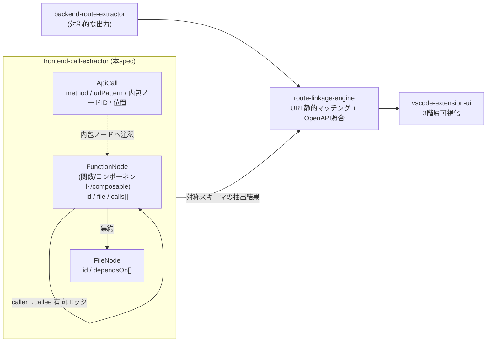

# Requirements Document

## Project Description (Input)
ApiVista のルート連携エンジン(route-linkage-engine)とグラフ可視化(vscode-extension-ui)は、Nuxt.js フロントエンドの「どのコード(コンポーネント/composable)が、どのURL/HTTPメソッドでAPIを呼び出し、内部でどのファイル・関数を経由しているか」という構造化データを必要とする。これが無いと、バックエンドルートとの連携判定も3階層可視化も実現できない。

現状(greenfield)、対象プロジェクトの `frontend/` 配下の Nuxt.js(Vue3/TS)コードを解析する仕組みは存在しない。

`frontend/` 配下の Vue/TS/JS ソースを静的解析(AST)し、以下を構造化データとして出力できるようにする:
- API呼び出し一覧(`$fetch`/`useFetch`/axios 等による HTTPメソッド・URLパターン・呼び出し元のファイル/関数位置)
- API呼び出しに至るまでのファイル単位・関数(コンポーネント/composable)単位の呼び出しグラフ(2レベル)

出力データは backend-route-extractor の出力と**対称的なスキーマ**とし、route-linkage-engine と vscode-extension-ui が共通利用できる形式とする。

実装方針(プロジェクト全体の steering [tech.md](../../steering/tech.md) に準拠): TypeScript + ts-morph(Vue SFC は別途 SFC パースを併用)で実装し、VSCode 拡張ホスト(Node/Electron)上でインプロセス動作させる。エンドユーザーに外部ランタイムの別途インストールを要求しない(「拡張を導入するだけで動作する」)。検証はブラウザを使用せず vitest による単体テストで行う。

### Scope
- **In**: Nuxt.js(Vue3 + `$fetch`/`useFetch`/axios)における API 呼び出しの検出と URL/method/呼び出し元位置の抽出、API呼び出しを起点としたファイル単位・関数(コンポーネント/composable)単位の呼び出しグラフ構築(静的解析)、抽出結果を backend-route-extractor と対称的なスキーマの構造化データとして出力するインターフェース
- **Out**: 動的解析・実行時トレース、バックエンド側の解析(backend-route-extractor が担当)、連携マッチングロジック(route-linkage-engine が担当)、VSCode拡張UIやWebview描画(vscode-extension-ui が担当)、Nuxt.js 以外のフレームワーク対応、リクエスト/レスポンスのボディ型(スキーマ)抽出(連携時の型照合は backend 側の OpenAPI/スキーマ参照に委ねる)

### Constraints
- 対象は `frontend/` ディレクトリ配下の Nuxt.js(Vue3)コードを前提とする
- 静的解析のみで、対象プロジェクトの実行・依存パッケージのインストールを抽出処理の前提条件としない
- 抽出器自体の実行に、利用者環境への外部の言語ランタイム・パッケージマネージャの別途インストールを前提としない
- 出力データスキーマは backend-route-extractor の出力と対称的に設計し、route-linkage-engine と vscode-extension-ui(3階層表示)双方の要件を満たすこと

## Introduction
Frontend Call Extractorは、Nuxt.js フロントエンド(`frontend/` 配下)の Vue/TS/JS ソースコードを静的解析し、API呼び出し(HTTPメソッド・URLパターン・呼び出し元位置)と、API呼び出しを起点とするファイル単位・関数(コンポーネント/composable)単位の呼び出しグラフを構造化データとして出力する。この出力は、route-linkage-engine による(URLパス静的マッチング+OpenAPIスキーマ照合の)連携付けと、vscode-extension-ui による3階層(ルート連携/ファイル単位/関数単位)可視化の入力契約として、backend-route-extractor の出力と対称的に利用される。

## Boundary Context
- **In scope**: `frontend/` 配下の API呼び出し(`$fetch`/`useFetch`/axios 等の認識パターン)の検出と method/URL/呼び出し元位置の抽出、API呼び出しを含むコード単位を起点とした `frontend/` 内のファイル単位・関数(コンポーネント/composable)単位の呼び出しグラフ構築、これらを統合した構造化データの出力
- **Out of scope**: バックエンド側コードの解析(backend-route-extractor)、ルートとAPI呼び出しの連携マッチング(route-linkage-engine)、UI/Webview可視化(vscode-extension-ui)、動的解析・実行時トレース、認識パターン以外のプログラム的なHTTPクライアント呼び出し、`frontend/` 外(node_modules・外部パッケージ)への呼び出し追跡、リクエスト/レスポンスのボディ型(スキーマ)抽出、**API呼び出しURLのbaseURL/相対パスのprefix補完・正規化(本抽出器は呼び出し位置のURLパターンをそのまま提供し、baseURL解決は route-linkage-engine が担当)**
- **Adjacent expectations**: 出力データスキーマは route-linkage-engine の入力契約と vscode-extension-ui の3階層表示要件を満たし、backend-route-extractor の出力(ルート定義・呼び出しグラフ・警告)と対称的な構造を持つことが前提となる。本抽出器は VSCode 拡張機能(vscode-extension-ui)から呼び出されて利用されることを前提とし、呼び出し側に外部ランタイムの別途用意を求めない

### データフロー位置と出力モデル(参考図)
本抽出器の位置づけ(左)と、出力モデルの骨子(右: API呼び出し + 有向呼び出しグラフ + 各API呼び出しを内包ノードへ注釈 = Req1.4/Req2.1/Req3。実フィールドは設計フェーズで確定):

## Requirements

### Requirement 1: API呼び出しの抽出
**Objective:** As a route-linkage-engineおよびvscode-extension-uiの開発者, I want フロントエンドの各API呼び出し(HTTPメソッド・URLパターン・呼び出し元位置)を構造化データとして取得したい, so that バックエンドルートとの連携判定やグラフ可視化の入力として利用できる

#### Acceptance Criteria
1. When `frontend/`配下のコードに認識対象のAPI呼び出しパターン(`$fetch`・`useFetch`、`axios` の `.get`/`.post`/`.put`/`.delete`/`.patch` 形態、およびオプションでHTTPメソッドを指定する呼び出し形態)が存在する場合, the Frontend Call Extractor shall その呼び出しのHTTPメソッド・URLパターン・呼び出し元のソース位置(ファイルパスおよび行番号)を抽出する
2. When HTTPメソッドが呼び出し名(例 `.get`)またはオプション(例 `{ method: ... }`)にリテラルとして現れる場合, the Frontend Call Extractor shall そのメソッドを抽出し, If いずれにもメソッド指定が無い場合, then the Frontend Call Extractor shall 当該呼び出し方式の既定メソッド(GET)として扱う
3. When URLが文字列リテラル、または静的なプレフィックスを持つテンプレートリテラル等(動的セグメントを含む)として表される場合, the Frontend Call Extractor shall リテラル部分を保持しつつ動的セグメントをプレースホルダへ正規化したURLパターンを当該API呼び出しに関連付けて出力する(backendのパスパラメータ表記と静的照合できる形式とする)
4. The Frontend Call Extractor shall 各API呼び出しを、それを内包する関数・コンポーネント・composable(呼び出しグラフの起点ノード)に関連付けて出力する
5. The Frontend Call Extractor shall 認識対象パターン以外のプログラム的なHTTPクライアント呼び出しを抽出対象としない

### Requirement 2: 呼び出しグラフの抽出
**Objective:** As a vscode-extension-uiの開発者, I want `frontend/`内の関数・コンポーネント・composable間の呼び出し関係(各API呼び出しがどのノードに属するかの注釈付き)を取得したい, so that 表示深度に応じた3階層の可視化と、API呼び出しへの到達経路の辿りが可能になる

#### Acceptance Criteria
1. The Frontend Call Extractor shall `frontend/`配下の関数・コンポーネント・composable間の呼び出し関係を、呼び出し元→呼び出し先の有向エッジとして表現した関数単位の呼び出しグラフを構築し、各API呼び出しをそれを内包するノードに関連付ける(エッジの辿る向き=到達経路/被呼び出しの解釈は消費側に委ねる)
2. The Frontend Call Extractor shall 関数単位の呼び出しグラフから、各呼び出し先が定義されているファイルを集約したファイル単位の呼び出しグラフを導出する
3. If 呼び出し先が`frontend/`ディレクトリ外(node_modules や外部パッケージ等)に存在する場合, then the Frontend Call Extractor shall その呼び出しを呼び出しグラフの終端として扱い、それ以上の追跡を行わない

### Requirement 3: 構造化データ出力
**Objective:** As route-linkage-engineおよびvscode-extension-uiの開発者, I want API呼び出しと呼び出しグラフを統合した3階層対応の構造化データを取得したい, so that 連携マッチングと深度切り替え可視化の双方の入力として利用できる

#### Acceptance Criteria
1. The Frontend Call Extractor shall 抽出した全てのAPI呼び出しと呼び出しグラフ(ファイル単位・関数単位)を1つの構造化データセットとして出力する
2. The Frontend Call Extractor shall 出力データを、ルート連携(階層1)・ファイル単位(階層2)・関数単位(階層3)のいずれの階層からも参照できる形式で表現し、backend-route-extractorの出力と対称的なスキーマとする
3. While 出力データセットが生成される, the Frontend Call Extractor shall 抽出した各API呼び出し・ファイル・関数をソースコード上の位置(ファイルパスおよび行番号)と関連付ける

### Requirement 4: エラーハンドリングと部分実行
**Objective:** As a開発者, I want 一部のファイルに問題があっても抽出処理全体が継続されることを期待する, so that 大規模なフロントエンドコードベースでも実用的な結果が得られる

#### Acceptance Criteria
1. If 解析対象のファイルに構文エラーが含まれる場合, then the Frontend Call Extractor shall 当該ファイルの解析をスキップし、他のファイルの解析を継続する
2. If API呼び出しのURLがパスの骨格自体を静的に決定できない(URL全体が変数・関数結果等で構成され、プレースホルダ正規化によってもパスパターンを確定できない)場合、またはHTTPメソッドが静的に決定できない場合, then the Frontend Call Extractor shall 当該API呼び出しを抽出結果から除外し、解析を継続する
3. When ファイルまたはAPI呼び出しが解析対象から除外された場合, the Frontend Call Extractor shall その除外理由を含む警告情報を出力データに記録する

### Requirement 5: 実行範囲とスコープ
**Objective:** As an operator, I want 抽出処理が`frontend/`ディレクトリと静的解析のみに限定され、かつ外部ランタイムの別途インストールなしに動作することを期待する, so that 実行結果が予測可能で安全であり、拡張機能を導入するだけで利用できる

#### Acceptance Criteria
1. The Frontend Call Extractor shall `frontend/`ディレクトリ配下のVue/TS/JSソースファイルのみを解析対象とする
2. The Frontend Call Extractor shall 対象プロジェクトのコードを実行せず、静的解析のみによって抽出処理を行う
3. The Frontend Call Extractor shall 対象プロジェクトの依存パッケージのインストールを抽出処理の前提条件としない
4. The Frontend Call Extractor shall 利用者環境への外部の言語ランタイムまたはパッケージマネージャの別途インストールを必要とせずに抽出処理を実行できる
