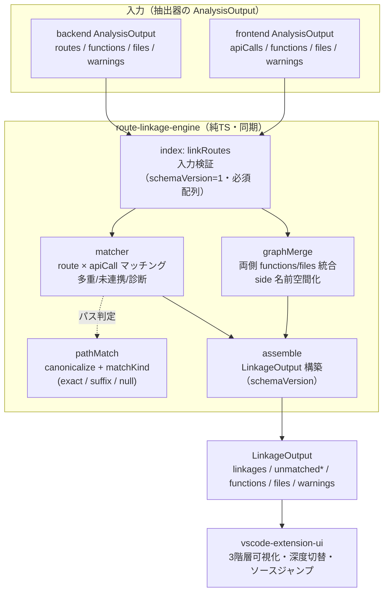
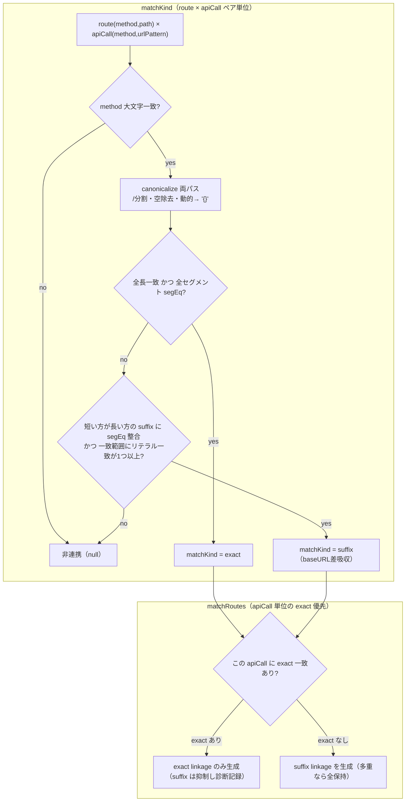
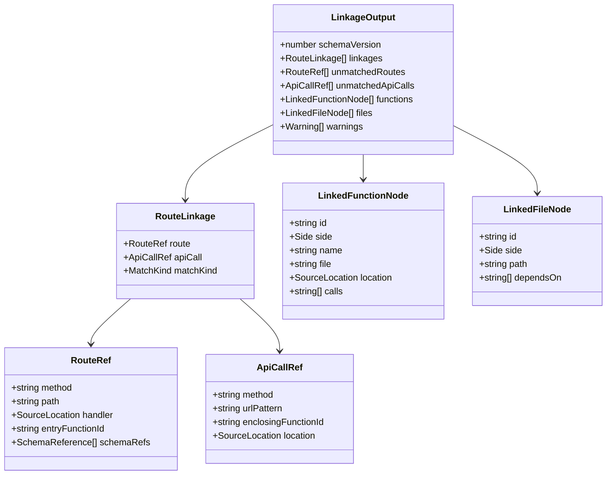

# Design Document: route-linkage-engine

## Overview
route-linkage-engine は、backend-route-extractor と frontend-call-extractor の `AnalysisOutput`(`schemaVersion=1`)を入力として受け取り、フロントエンドのAPI呼び出しとバックエンドのルートを **URLパス(パスパラメータ正規化)+ HTTPメソッド**の静的マッチングで連携付け、両抽出器の関数/ファイル呼び出しグラフを統合した **3階層(ルート連携/ファイル単位/関数単位)** の単一構造化データ `LinkageOutput` を生成する、拡張ホスト内インプロセスの純TSモジュールである。出力は vscode-extension-ui の3階層可視化・深度切り替え・ソースジャンプの入力契約となる。

抽出(ソース解析)は行わず、与えられたデータのみを決定的に変換する。外部ランタイム・ネイティブ依存・新規パッケージは不要。

## Boundary Commitments
- **所有(this spec owns)**:
  - 両 `AnalysisOutput` を入力とする入力検証
  - URLパス静的マッチング(パスパラメータ正規化・baseURL/相対パスの suffix 吸収)+ HTTPメソッド一致判定
  - 連携(linkage)の構築:多重一致の全保持・前後双方の未連携保持・診断記録
  - バックエンドスキーマ参照(`schemaRefs`)の**表示用付帯**(連携の絞り込みには非使用)
  - 両側の関数/ファイル呼び出しグラフの統合(side 名前空間化による一意化)
  - 3階層統合データモデル `LinkageOutput` の生成と公開API/CLI
- **非所有(out of boundary)**:
  - バックエンド/フロントエンドのソース解析(各抽出器が担当)
  - VSCode拡張UI・Webview描画・深度切り替えUI・ソースジャンプ実装(vscode-extension-ui が担当)
  - 動的解析・実行時連携検証
  - **リクエスト/レスポンス型(スキーマ)による連携の絞り込み(disambiguation)**(v1 非対応・将来拡張)
- **許可依存(allowed dependencies)**:
  - `src/backend-analysis/models.ts` / `src/frontend-analysis/models.ts` からの **型のみ import**(read-only、挙動結合なし)
  - 標準ライブラリのみ。新規 npm 依存・ネイティブ/外部ランタイムは不可
- **再検証トリガ(revalidation triggers)**:
  - 入力 `AnalysisOutput` のスキーマ(`schemaVersion` / フィールド構造)変更
  - 出力 `LinkageOutput` のスキーマ(本spec の `SCHEMA_VERSION`)変更
  - frontend がスキーマ情報を提供開始した場合(スキーマ照合 disambiguation の将来拡張)
  - `src/shared/` 型統合の実施(現状は据え置き=下記)

### 共有型(`src/shared/`)の設計判断
backend/frontend が `FunctionNode`/`FileNode`/`Warning`/`SourceLocation` を重複定義しているが、**v1 では物理統合しない**。route-linkage は両 `models.ts` から型のみ import し、出力型は `src/route-linkage/models.ts` に自前定義する。`src/shared/` への共通化は完成済み2スペックの改変・再検証を要するため将来リファクタ候補とし、再検証トリガに紐づける(根拠は research.md)。

## Architecture



### System Flow: パスマッチング判定（exact優先 + リテラル必須ガード）
過剰連携(over-matching)を抑制するため、(1) ペア単位の `matchKind` 判定でガードをかけ、(2) 呼び出し単位で exact を優先する。


- `segEq(x,y) = (x===y) || x==="{}" || y==="{}"`(動的セグメントはパラメータ名非依存のワイルドカード)。
- **リテラル必須ガード(Issue1対策)**: suffix 一致は、重なり区間に**少なくとも1つのリテラル(非 `{}`)セグメント一致**を含む場合のみ成立とする。これにより `["{}"]` や `["{}","{}"]` のような純ワイルドカード末尾が全ルートに一致する暴発を排除する(Req2.3 の「baseURL/共通プレフィックス差のみ吸収」の意図に整合)。
- **exact 優先(Issue1対策)**: あるフロント呼び出しに exact 一致が1つでも存在する場合、その呼び出しの suffix 連携は出力せず、抑制した旨を診断(`Warning`)に記録する。exact が無い呼び出しのみ suffix 連携を(多重なら全)保持する。

### Data Models

**名前空間化の不変条件**: `entryFunctionId` / `enclosingFunctionId` / `LinkedFunctionNode.calls[]` / `LinkedFunctionNode.file` / `LinkedFileNode.dependsOn[]` は全て **side 接頭辞付きID**(`"backend:"|"frontend:" + originalId`)で、`functions`/`files` 配列内の実在ノードを指す(参照貫通=Req5.4)。`side` で出自を一意識別(Req5.6)。

## Components and Interfaces

すべて TypeScript。`any` 不使用。公開APIは純粋・同期。型は backend/frontend `models.ts` から read-only import、出力型は本spec で定義。

### models.ts(出力型・schemaVersion・型ガード)
```ts
export const SCHEMA_VERSION = 1 as const;
export type Side = "backend" | "frontend";
export type MatchKind = "exact" | "suffix";

// 入力側 SourceLocation/Warning/SchemaReference と同形（read-only 利用のため再宣言 or import）
export interface SourceLocation { file: string; line: number; }
export interface Warning { target: string; reason: string; }
export interface SchemaReference { className: string; location: SourceLocation; role: "request" | "response"; }

export interface RouteRef {
  method: string; path: string; handler: SourceLocation;
  entryFunctionId: string;       // 名前空間化済み "backend:<id>"
  schemaRefs: SchemaReference[]; // 表示用付帯
}
export interface ApiCallRef {
  method: string; urlPattern: string;
  enclosingFunctionId: string;   // 名前空間化済み "frontend:<id>"
  location: SourceLocation;
}
export interface RouteLinkage { route: RouteRef; apiCall: ApiCallRef; matchKind: MatchKind; }
export interface LinkedFunctionNode {
  id: string; side: Side; name: string; file: string;
  location: SourceLocation; calls: string[]; // 名前空間化済み
}
export interface LinkedFileNode { id: string; side: Side; path: string; dependsOn: string[]; }
export interface LinkageOutput {
  schemaVersion: number;
  linkages: RouteLinkage[];
  unmatchedRoutes: RouteRef[];
  unmatchedApiCalls: ApiCallRef[];
  functions: LinkedFunctionNode[];
  files: LinkedFileNode[];
  warnings: Warning[];
}
export function isLinkageOutput(value: unknown): value is LinkageOutput; // schemaVersion + 必須配列を検査
```

### ids.ts(名前空間化)
```ts
export function namespaceId(side: Side, originalId: string): string; // `${side}:${originalId}`
export function namespaceFunctions(side: Side, fns: FunctionNode[]): LinkedFunctionNode[]; // id/file/calls を名前空間化
export function namespaceFiles(side: Side, files: FileNode[]): LinkedFileNode[];          // id/dependsOn を名前空間化
```

### pathMatch.ts(URLパス正規化・判定)
```ts
export function canonicalize(path: string): string[];        // /分割・空除去・動的→ "{}"
export function methodEquals(a: string, b: string): boolean; // 大文字一致
// exact: 全長一致かつ全セグメント segEq。
// suffix: 短い方が長い方の末尾に segEq 整合 かつ 一致範囲に**リテラル(非 "{}")一致が1つ以上**（リテラル必須ガード）。
// それ以外は null。method 不一致も null。
export function matchKind(routePath: string, apiUrlPattern: string): MatchKind | null;
```

### matcher.ts(連携構築)
```ts
export interface MatchResult {
  linkages: RouteLinkage[];
  unmatchedRoutes: RouteRef[];
  unmatchedApiCalls: ApiCallRef[];
  diagnostics: Warning[]; // 多重一致・未連携の機械可読理由
}
export function matchRoutes(
  routes: RouteDefinition[],   // backend 由来
  apiCalls: ApiCall[],         // frontend 由来
): MatchResult;
// 各 apiCall について全 route と methodEquals かつ matchKind!=null を評価。
// exact 優先: その apiCall に exact 一致があれば exact linkage のみ採用し、
//   同 apiCall の suffix 一致は抑制して diagnostics に記録（Issue1対策）。
//   exact が無ければ suffix linkage を採用（多重一致は全保持＝Req3.1）。
// 一致0の apiCall/route を unmatched に（Req3.2/3.3）。多重一致・suffix抑制は diagnostics（Req3.4）。
// RouteRef/ApiCallRef の entryFunctionId/enclosingFunctionId は名前空間化して格納。
```

### graphMerge.ts(グラフ統合)
```ts
export function mergeFunctions(be: FunctionNode[], fe: FunctionNode[]): LinkedFunctionNode[]; // 名前空間化して連結
export function mergeFiles(be: FileNode[], fe: FileNode[]): LinkedFileNode[];
```

### assemble.ts(統合)
```ts
export function assembleLinkage(
  match: MatchResult,
  functions: LinkedFunctionNode[],
  files: LinkedFileNode[],
  inputWarnings: Warning[],   // 両入力 warnings を結合
): LinkageOutput; // schemaVersion=1、warnings=inputWarnings+match.diagnostics
// 決定性（Issue2 / Req7.3）: 入力配列順の揺れに依存せず安定出力するため、各配列を正準ソートする。
//   linkages: (apiCall.location.file, line, route.method, route.path) 昇順
//   unmatchedRoutes: (method, path) 昇順 / unmatchedApiCalls: (location.file, line, urlPattern) 昇順
//   functions: id 昇順 / files: id 昇順（id は side 接頭辞付きで一意）
```

### index.ts(公開API)
```ts
export function linkRoutes(
  backendOutput: BackendAnalysisOutput,   // backend-analysis/models の AnalysisOutput 型
  frontendOutput: FrontendAnalysisOutput, // frontend-analysis/models の AnalysisOutput 型
): LinkageOutput;
// 1) 入力検証（schemaVersion=1・必須配列。不正は throw=Req1.2）
// 2) match = matchRoutes(backend.routes, frontend.apiCalls)
// 3) functions = mergeFunctions(backend.functions, frontend.functions)
//    files = mergeFiles(backend.files, frontend.files)
// 4) return assembleLinkage(match, functions, files, [...backend.warnings, ...frontend.warnings])
// 純粋・同期・決定的（Req7.1/7.3）。対象コード非実行（Req7.1）。
export { SCHEMA_VERSION } from "./models.js";
export type { LinkageOutput, RouteLinkage, RouteRef, ApiCallRef, LinkedFunctionNode, LinkedFileNode } from "./models.js";
```

### cli.ts(開発/E2E用・薄いラッパ)
```ts
// 2つの AnalysisOutput JSON ファイルパスを引数に取り、linkRoutes の結果を
// stdout へ単一 JSON、ログを stderr。引数不正/ファイル不正は非0終了、成功は0。
// 解析の実行（analyzeBackend/analyzeFrontend）は本specの責務外＝JSON入力前提。
```

## File Structure Plan
```
src/route-linkage/
├── index.ts          # 公開API linkRoutes（入力検証 + オーケストレーション）。純粋・同期
├── models.ts         # LinkageOutput 等 出力型 + SCHEMA_VERSION + isLinkageOutput 型ガード
├── ids.ts            # side 名前空間化（namespaceId / namespaceFunctions / namespaceFiles）
├── pathMatch.ts      # canonicalize / matchKind / methodEquals（URLパス正規化・判定）
├── matcher.ts        # matchRoutes（連携構築・多重/未連携・診断・RouteRef/ApiCallRef 生成）
├── graphMerge.ts     # mergeFunctions / mergeFiles（両側グラフ統合）
├── assemble.ts       # assembleLinkage（LinkageOutput 統合）
└── cli.ts            # 開発/E2E用 薄いNode CLI（2 JSON入力 → JSON出力）
src/route-linkage/__tests__/*.test.ts   # vitest 単体/統合/E2E
```
- 入力型は `src/backend-analysis/models.ts` / `src/frontend-analysis/models.ts` から read-only import(改変しない)。
- E2E は既存フィクスチャ `tests/fixtures/sample_app`(backend)/`tests/fixtures/sample_nuxt`(frontend)の解析結果を題材にできる(CLI は両抽出器の JSON 出力を入力)。
- 変更ファイル: `package.json` への新規依存追加は**不要**(純TS)。

## Testing Strategy(受入基準由来・vitest)
- **pathMatch**: `canonicalize`(`/api/users/{id}`→`["api","users","{}"]`、`/api/users/${id}` 由来 `/api/users/{}` も同結果)、`matchKind`(完全一致=exact、`/users` vs `/api/users`=suffix、method 不一致=null、別パス=null)。**リテラル必須ガード**(`["{}"]` や `["{}","{}"]` の純ワイルドカード末尾は suffix にならず null)(Req2.1/2.2/2.3)
- **ids**: `namespaceId`/`namespaceFunctions`/`namespaceFiles` が id/file/calls/dependsOn を一貫して名前空間化、可逆(Req5.4/5.6)
- **matcher**: 単一一致→linkage、1呼び出しが複数ルート一致→複数 linkage 全保持(Req3.1)、**exact 優先**(exact があれば同 apiCall の suffix を抑制し diagnostics 記録)、未連携 apiCall/route が unmatched に(Req3.2/3.3)、多重/suffix抑制/未連携が diagnostics に記録(Req3.4)、RouteRef に schemaRefs 付帯(Req4.1)、スキーマは絞り込みに不使用(Req4.2)
- **決定性**: 同一入力(配列順を入れ替えても)に対し assemble の正準ソートにより同一の出力配列順となる(Issue2/Req7.3)
- **graphMerge**: 両側 functions/files が side 付き・名前空間化で統合、ID衝突しても一意(Req5.2/5.3/5.6)
- **assemble + index**: 単一 LinkageOutput(schemaVersion=1)、linkage→route/apiCall→関数ノード→ファイルノードの参照貫通(Req5.1/5.4/5.5)、warnings に両入力警告+診断を集約(Req6.1/6.3)、部分不一致でも返す(Req6.4)、入力検証 throw(Req1.2)、決定的出力(Req7.3)
- **入力検証**: `schemaVersion!=1` / 必須配列欠落で throw、抽出を行わない(Req1.1/1.3/7.1)
- **E2E(cli)**: sample_app/sample_nuxt 解析 JSON を入力に、stdout 単一 JSON・stderr 非JSON・引数不正で非0・外部ランタイム無しで Node 完走(Req6.1/7.2)

## Requirements Traceability
| Requirement | 対応コンポーネント |
| --- | --- |
| 1.1 入力受領 | index.linkRoutes |
| 1.2 入力検証(不正→throw) | index(検証)、models.isLinkageOutput 相当の入力ガード |
| 1.3 抽出非担当(静的) | index(与えられたデータのみ使用) |
| 2.1 URL+method 連携 | matcher.matchRoutes + pathMatch.matchKind/methodEquals |
| 2.2 パスパラメータ正規化 | pathMatch.canonicalize/segEq |
| 2.3 baseURL/相対 suffix 吸収 | pathMatch.matchKind(suffix・リテラル必須ガード)+ matcher(exact優先) |
| 2.4 連携の参照表現 | matcher(RouteRef/ApiCallRef) |
| 3.1 多重一致全保持 | matcher(全列挙) |
| 3.2/3.3 未連携保持 | matcher(unmatchedRoutes/ApiCalls) |
| 3.4 判定理由の診断記録 | matcher.diagnostics → assemble.warnings |
| 4.1 スキーマ参照付帯 | matcher(RouteRef.schemaRefs) |
| 4.2 スキーマで絞り込まない | matcher(schemaRefs は出力のみ・判定非使用) |
| 5.1 3階層単一モデル | assemble.assembleLinkage |
| 5.2 関数グラフ統合 | graphMerge.mergeFunctions |
| 5.3 ファイルグラフ統合 | graphMerge.mergeFiles |
| 5.4 参照貫通(ID保持) | ids.namespace*(名前空間化IDで貫通) |
| 5.5 位置情報関連付け | RouteRef.handler/ApiCallRef.location/LinkedFunctionNode.location |
| 5.6 front/back 一意識別 | ids(side 接頭辞)+ LinkedNode.side |
| 6.1 単一構造化出力 | assemble |
| 6.2 schemaVersion 付与 | models.SCHEMA_VERSION |
| 6.3 警告集約 | assemble(入力warnings + diagnostics) |
| 6.4 部分不一致でも返す | matcher/assemble(unmatched 保持) |
| 7.1 静的・非実行 | index(データのみ) |
| 7.2 外部ランタイム不要 | 純TS・依存追加なし |
| 7.3 決定的出力 | 全コンポーネント純関数 |
