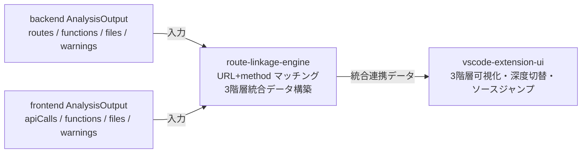

# Requirements Document

## Project Description (Input)
route-linkage-engine は、ApiVista のルート連携可視化の中核データを生成するスペックである。

- **誰が困っているか**: vscode-extension-ui(可視化)と、その先のエンドユーザー(モノレポを保守する開発者)。
- **現状(greenfield)**: backend-route-extractor と frontend-call-extractor はそれぞれ独立に「バックエンドのルート定義・OpenAPIスキーマ参照・呼び出しグラフ」と「フロントエンドのAPI呼び出し・呼び出しグラフ」を `AnalysisOutput`(対称スキーマ・`schemaVersion=1`)として出力するが、両者を「どのフロントエンド呼び出しがどのバックエンドルートに対応するか」という**連携関係**として結びつける仕組みが存在しない。
- **何を変えるか**: 両抽出器の出力を入力として受け取り、(1) URLパス(パスパラメータ考慮)と HTTPメソッドの静的マッチングで連携付けし、(2) ルート連携(階層1)/ファイル単位(階層2)/関数単位(階層3)の**3階層で参照可能な統合データモデル**を構築し、(3) vscode-extension-ui が利用できる構造化データとして出力する。

実装方針(steering [tech.md](../../steering/tech.md) に準拠): TypeScript で実装し、VSCode 拡張ホスト(Node/Electron)上でインプロセス動作させる。外部ランタイムは不要。検証はブラウザを使用せず vitest による単体テストで行う。

## Introduction
Route Linkage Engine は、backend-route-extractor の `AnalysisOutput`(ルート定義・スキーマ参照・呼び出しグラフ・警告)と frontend-call-extractor の `AnalysisOutput`(API呼び出し・呼び出しグラフ・警告)を入力として受け取り、フロントエンドのAPI呼び出しとバックエンドのルートを **URLパス + HTTPメソッド**の静的マッチングで連携付ける。さらに両抽出器が提供する関数/ファイル単位の呼び出しグラフを統合し、**ルート連携(階層1)/ファイル単位(階層2)/関数単位(階層3)**の3階層で参照可能な単一の構造化データセットを構築して出力する。この出力は vscode-extension-ui による3階層可視化・深度切り替え・ソースジャンプの直接の入力契約となる。

## Boundary Context
- **In scope**: 両抽出器の `AnalysisOutput` を入力とする連携マッチング、URLパス静的マッチング(パスパラメータ正規化・baseURL/相対パスの差異吸収)、HTTPメソッド一致判定、連携結果へのバックエンドスキーマ参照の付帯、両抽出器の関数/ファイル呼び出しグラフの統合、3階層(ルート連携/ファイル単位/関数単位)の統合データモデル構築、統合結果の構造化データ出力インターフェース
- **Out of scope**: バックエンド/フロントエンドのソースコード解析そのもの(各抽出器が担当)、VSCode拡張UI・Webview描画・深度切り替えUI・ソースジャンプの実装(vscode-extension-ui が担当)、動的解析・実行時の連携検証、**リクエスト/レスポンスのボディ型(スキーマ)による連携の絞り込み(disambiguation)**(フロントエンド側にスキーマ情報が存在しないため v1 では非対応。将来拡張)
- **Adjacent expectations**: 入力スキーマは backend-route-extractor / frontend-call-extractor の `AnalysisOutput`(`schemaVersion=1`)に依存する。出力スキーマは vscode-extension-ui の3階層表示(深度切り替え)・ソースジャンプ要件を満たすこと。本エンジンは vscode-extension-ui から呼び出されて利用されることを前提とし、呼び出し側に外部ランタイムの別途用意を求めない。

### スキーマ照合(OpenAPI)の扱いに関する設計判断
brief は「URLパス静的マッチング + OpenAPIスキーマ照合のハイブリッド」を掲げるが、入力 `ApiCall`(frontend)は method / urlPattern / 内包ノード / 位置のみで**リクエスト/レスポンスのスキーマ情報を持たない**(frontend-call-extractor が明示的に Out-of-scope 化)。したがって v1 では:
- 連携判定の主軸は **URLパス(パスパラメータ考慮)+ HTTPメソッド**とする。
- バックエンドの `schemaRefs`(リクエスト/レスポンスモデル参照)は、連携結果に**表示用の付帯情報**として添付する(連携候補の絞り込みには使わない)。
- スキーマ照合による disambiguation は、フロントエンドがスキーマ情報を提供できるようになった時点での**将来拡張**として保留する(再検証トリガ)。

### データフロー位置(参考図)

## Requirements

### Requirement 1: 入力の受領と検証
**Objective:** As a vscode-extension-uiの開発者, I want 両抽出器の出力を入力として安全に受け取れる, so that 連携処理を予測可能な前提のもとで開始できる

#### Acceptance Criteria
1. The Route Linkage Engine shall backend-route-extractor の `AnalysisOutput`(ルート定義・関数/ファイル呼び出しグラフ・警告)と frontend-call-extractor の `AnalysisOutput`(API呼び出し・関数/ファイル呼び出しグラフ・警告)の2つを入力として受け取る。
2. If いずれかの入力が想定するスキーマバージョン(`schemaVersion=1`)・必須フィールド構造を満たさない場合, then the Route Linkage Engine shall その入力を不正として扱い、処理を中断するエラーを返す。
3. The Route Linkage Engine shall 対象プロジェクトのソースコードを解析せず、与えられた `AnalysisOutput` のみを入力として連携処理を行う(抽出は各抽出器の責務)。

### Requirement 2: URLパスとHTTPメソッドによる連携マッチング(階層1)
**Objective:** As a route連携を見たい開発者, I want どのフロントエンドAPI呼び出しがどのバックエンドルートに対応するかを特定したい, so that ルートレベルの連携関係を把握できる

#### Acceptance Criteria
1. When フロントエンドのAPI呼び出しの HTTPメソッドがバックエンドルートの HTTPメソッドと一致し、かつ両者の URLパスパターンがパスパラメータ正規化のもとで等価である場合, the Route Linkage Engine shall その呼び出しと当該ルートを連携(リンク)として関連付ける。
2. The Route Linkage Engine shall URLパスパターンの比較において、動的セグメント(バックエンドの名前付きパスパラメータ `{name}` とフロントエンドの正規化済みプレースホルダ `{}`)を、パラメータ名に依存しない単一のワイルドカードセグメントとして等価に扱う。
3. When フロントエンドのURLパターンとバックエンドのパスが、先頭の baseURL / 共通プレフィックスの差異のみで実質的に同一エンドポイントを指す場合, the Route Linkage Engine shall それらを連携候補として識別する(相対パス・baseURL の差異を吸収する)。
4. The Route Linkage Engine shall 各連携を、対応するフロントエンドAPI呼び出し(method・URLパターン・内包ノード・位置)とバックエンドルート(method・完全パス・ハンドラ位置・エントリ関数)への参照とともに表現する。

### Requirement 3: 連携の多重一致・不一致の扱い
**Objective:** As a可視化の利用者, I want 連携が一意でない場合や対応が見つからない場合も結果が破綻せず把握できる, so that 実プロジェクトの不完全な対応関係も安全に閲覧できる

#### Acceptance Criteria
1. If 1つのフロントエンドAPI呼び出しが複数のバックエンドルートに一致する場合, then the Route Linkage Engine shall その全ての一致を連携候補として保持し、いずれも破棄しない。
2. If フロントエンドAPI呼び出しに一致するバックエンドルートが存在しない場合, then the Route Linkage Engine shall 当該呼び出しを「未連携のフロントエンド呼び出し」として出力に保持する。
3. If バックエンドルートに一致するフロントエンドAPI呼び出しが存在しない場合, then the Route Linkage Engine shall 当該ルートを「未連携のバックエンドルート」として出力に保持する。
4. While 連携結果を構築している間, the Route Linkage Engine shall 多重一致・未連携などの判定理由を機械可読な診断情報として出力データに記録する。

### Requirement 4: スキーマ参照の付帯(表示用・絞り込みには非使用)
**Objective:** As a連携の詳細を見たい開発者, I want 連携したルートのリクエスト/レスポンス型情報を併せて参照したい, so that 連携の意味をより具体的に理解できる

#### Acceptance Criteria
1. The Route Linkage Engine shall 連携(およびバックエンドルート)に、バックエンド由来のスキーマ参照(モデルクラス名・定義位置・role=request/response)を表示用の付帯情報として関連付ける。
2. The Route Linkage Engine shall リクエスト/レスポンスのボディ型(スキーマ)情報を連携候補の絞り込み(disambiguation)には使用しない(v1 ではフロントエンド側にスキーマ情報が存在しないため)。

### Requirement 5: 3階層統合データモデルの構築
**Objective:** As a vscode-extension-uiの開発者, I want ルート連携・ファイル単位・関数単位の3階層を1つのデータから参照したい, so that 深度切り替え可視化とソースジャンプを実装できる

#### Acceptance Criteria
1. The Route Linkage Engine shall ルート連携(階層1)・ファイル単位(階層2)・関数単位(階層3)のいずれの階層からも参照できる単一の統合データモデルを構築する。
2. The Route Linkage Engine shall バックエンドとフロントエンド双方の関数単位呼び出しグラフ(関数ノードと呼び出しエッジ)を統合データモデルに含める。
3. The Route Linkage Engine shall バックエンドとフロントエンド双方のファイル単位呼び出しグラフ(ファイルノードと依存エッジ)を統合データモデルに含める。
4. The Route Linkage Engine shall 階層間の参照(連携→ルート/呼び出し、ルート/呼び出し→関数ノード、関数ノード→ファイルノード)を、各抽出器が採番した識別子(関数ID・ファイルID)を保持したまま貫通して辿れる形で表現する。
5. The Route Linkage Engine shall 各連携・ルート・API呼び出し・関数・ファイルを、ソースコード上の位置(ファイルパスおよび行番号)と関連付ける(ソースジャンプの入力となる)。
6. The Route Linkage Engine shall バックエンド由来とフロントエンド由来のノード・識別子を、両者が混在しても一意に識別できる形で統合データモデル内に表現する。

### Requirement 6: 構造化データ出力
**Objective:** As route-linkage-engineの利用者(vscode-extension-ui), I want 統合連携データを安定した構造化データとして取得したい, so that 可視化の入力契約として確実に利用できる

#### Acceptance Criteria
1. The Route Linkage Engine shall 連携・3階層グラフ・診断情報を1つの構造化データセットとして出力する。
2. The Route Linkage Engine shall 出力データセットにスキーマバージョンを付与し、vscode-extension-ui が互換性を判定できるようにする。
3. The Route Linkage Engine shall 入力(両抽出器)で記録された警告と、本エンジンが連携処理中に生成した診断情報を、出力データセットに集約して保持する。
4. While 一部のルートまたは呼び出しが連携できない場合でも, the Route Linkage Engine shall 連携できた範囲を含む統合データセットを生成して返す(部分的な不一致で全体を失敗させない)。

### Requirement 7: 実行範囲とスコープ
**Objective:** As an operator, I want 連携処理が静的・インプロセスで、外部ランタイムなしに動作することを期待する, so that 拡張機能を導入するだけで予測可能・安全に利用できる

#### Acceptance Criteria
1. The Route Linkage Engine shall 与えられた `AnalysisOutput` のみを用いた静的処理によって連携を構築し、対象プロジェクトのコードを実行しない。
2. The Route Linkage Engine shall 利用者環境への外部の言語ランタイムまたはパッケージマネージャの別途インストールを必要とせずに連携処理を実行できる(拡張ホスト=Node/Electron 上でインプロセス動作)。
3. The Route Linkage Engine shall 同一の入力に対して決定的な(同一の)出力を生成する。
