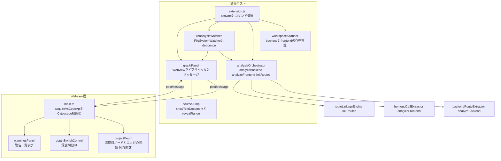
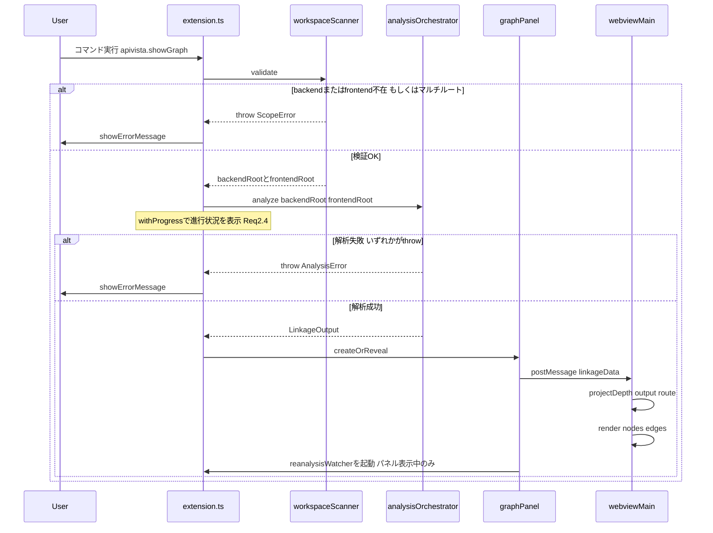
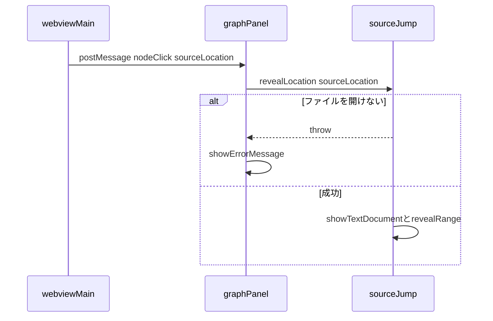
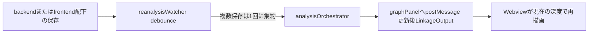

# Design Document: vscode-extension-ui

## Overview
vscode-extension-ui は、backend-route-extractor / frontend-call-extractor / route-linkage-engine の3spec(いずれも実装済み)が提供する公開API(`analyzeBackend` / `analyzeFrontend` / `linkRoutes`)を実行時に呼び出し、その出力 `LinkageOutput` をVSCode拡張のWebview上にグラフとして可視化する拡張機能本体である。3階層(ルート連携/ファイル単位/関数単位)の深度切替、グラフノードからのソースジャンプ、ソースコード変更に追従した再解析(自動ファイル監視+手動コマンド)、警告・エラーの可視化を提供する。

**Users**: モノレポ(`backend/`+`frontend/`)を保守する開発者が、コマンドパレットからグラフを開き、深度を切り替えながら連携関係を確認し、ノードクリックでソースへ移動する。

**Impact**: greenfieldのため既存システムへの影響はない。`package.json` に拡張マニフェスト(`engines`/`main`/`contributes`/`activationEvents`)を新規に確立する。

### Goals
- ワークスペーススキャン→3spec呼び出し→Webviewグラフ描画の一連のオーケストレーションを提供する
- ルート連携/ファイル単位/関数単位の3段階深度切替と、グラフノードからのソースジャンプを提供する
- 自動ファイル監視(パネル表示中のみ)と手動再解析コマンドの両方で連携データを最新化する
- 警告・解析失敗をUI上で視認可能にする

### Non-Goals
- バックエンド/フロントエンドのルート・呼び出し抽出ロジック自体(backend-route-extractor / frontend-call-extractor が担当)
- 連携マッチングロジック自体(route-linkage-engine が担当)
- 動的解析・実行時トレース
- マルチルートワークスペース(複数ワークスペースフォルダ)対応
- 対象プロジェクトのコード実行(本spec・上流3specいずれも静的解析結果のみを用いる)

## Boundary Commitments

### This Spec Owns
- VSCode拡張のアクティベーション・コマンド登録・マニフェスト確立(`engines`/`main`/`contributes`/`activationEvents`)
- ワークスペーススキャン(単一ルート前提の`backend/`・`frontend/`存在検証)
- 3spec公開API(`analyzeBackend`/`analyzeFrontend`/`linkRoutes`)の呼び出しオーケストレーションとエラー正規化
- Webviewパネルのライフサイクル・HTML/CSP構築・拡張⇄Webview間メッセージプロトコル
- 深度別(ルート連携/ファイル単位/関数単位)グラフ投影ロジックとCytoscape.jsによる描画
- グラフノードクリックからのソースジャンプ
- ファイル監視(パネル表示中のみ)による自動再解析と、手動再解析コマンド
- 警告(`LinkageOutput.warnings`)および解析失敗のUI表示

### Out of Boundary
- backend-route-extractor / frontend-call-extractor / route-linkage-engine の解析・連携ロジック自体(本specはこれらを呼び出す側であり、内部実装には関与しない)
- マルチルートワークスペースのサポート(明示的に拒否する。将来拡張は別途再検証)
- 動的解析・実行時トレース
- グラフ描画ライブラリ自体の機能拡張(Cytoscape.js本体への変更や独自フォーク)

### Allowed Dependencies
- `src/backend-analysis/index.ts`(`analyzeBackend`)、`src/frontend-analysis/index.ts`(`analyzeFrontend`)、`src/route-linkage/index.ts`(`linkRoutes`)からの**値import**(本specは3specの公開APIを実行時に呼び出す唯一の消費者であり、route-linkage-engineが課されていた「型のみimport」制約はここでは適用されない。3specいずれもその出力型(`AnalysisOutput`/`LinkageOutput`)も合わせてimportする)
- VSCode Extension API(`vscode`モジュール)、Node標準API(拡張ホスト側コード)
- Cytoscape.js(Webviewバンドル内、`dependencies`)
- esbuild(Webviewバンドルのビルド時ツール、`devDependencies`。配布物には成果物`media/webview/bundle.js`のみ同梱し、esbuild自体は同梱しない)

### Revalidation Triggers
- route-linkage-engine の `LinkageOutput`(`schemaVersion`)変更
- backend-route-extractor / frontend-call-extractor の公開API(`analyzeBackend`/`analyzeFrontend`)のシグネチャまたはエラー挙動の変更
- マルチルートワークスペース対応の追加(本spec範囲外からのスコープ拡張)
- Webviewへ送信するデータ規模が増大し、ページング/遅延ロードが必要になった場合(research.md Risks参照)

## Architecture

### Architecture Pattern & Boundary Map
拡張ホスト層(VSCode API・3spec呼び出し・メッセージプロトコルのホスト側)とWebview層(グラフ描画・深度切替・クリックイベント)を明確に分離する。Webview層は`vscode`モジュールへの直接アクセスを持たない(VSCode Webviewのプラットフォーム制約により実行時にも不可能)。



**Architecture Integration**:
- 選択パターン: 拡張ホスト/Webviewの2層分離(VSCode拡張の標準パターン)。深度投影ロジック(`projectDepth`)をCytoscape描画から分離し純粋関数として切り出すことで、DOM/Canvas非依存のテスト容易性を確保する(research.md「Decision: 深度別グラフ投影ロジックを純粋関数として分離」)。
- 既存パターンの再利用: 3spec(backend-analysis/frontend-analysis/route-linkage)の`cli.ts`で確立済みの「try/catchでエラーを正規化し呼び出し元に伝播」規約をAnalysisOrchestratorでも踏襲する。
- 新規コンポーネントの根拠: WorkspaceScanner(単一ルート前提・存在検証はどの3specも持たない本spec固有の責務)、ReanalysisWatcher(パネル表示中のみ稼働、VSCode標準APIのみ)、GraphPanel/SourceJump(VSCode Webview特有の責務)。
- steering準拠: TypeScript strict、外部ランタイム不要(`tech.md`)、ブラウザE2E不使用(`@vscode/test-electron`+vitest/jsdomのみ)。

### Technology Stack

| Layer | Choice / Version | Role in Feature | Notes |
|-------|------------------|-----------------|-------|
| 拡張ホスト | TypeScript(既存strict設定)+ VSCode Extension API(`@types/vscode` ^1.90.0 既存) | アクティベーション・コマンド・Webviewライフサイクル・3spec呼び出し | 新規依存なし |
| Webview描画 | Cytoscape.js(新規 `dependencies`) | グラフ描画・深度フィルタ・クリックイベント | MIT、研究結果はresearch.md参照 |
| Webviewビルド | esbuild(新規 `devDependencies`) | Webview用TSを単一JSバンドルへ変換 | 開発時ツール、配布物には成果物のみ同梱 |
| ファイル監視 | `vscode.workspace.createFileSystemWatcher`(標準API) | backend/frontend配下の保存検知 | 新規依存なし |
| テスト(拡張ホスト統合) | `@vscode/test-electron`(既存 ^2.4.0) | 実VSCode起動によるアクティベーション・コマンド・統合検証 | 新規依存なし |
| テスト(Webview単体) | vitest + jsdom(既存) | `projectDepth`/`depthSwitchControl`/`warningsPanel`の純粋ロジック検証 | Cytoscape本体の描画初期化はDOM/Canvas依存のため対象外(目視確認) |

## File Structure Plan

### Directory Structure
```
src/vscode-extension/
├── extension.ts              # activate/deactivate、コマンド登録、各コンポーネントの結線
├── workspaceScanner.ts       # 単一ルート前提のbackend/frontend存在検証
├── analysisOrchestrator.ts   # analyzeBackend→analyzeFrontend→linkRoutesの順次呼び出しとエラー正規化
├── reanalysisWatcher.ts      # FileSystemWatcher+debounce(パネル表示中のみ稼働)
├── graphPanel.ts             # WebviewPanelライフサイクル、メッセージ送受信
├── sourceJump.ts             # SourceLocation(file+line)→showTextDocument+revealRange
├── webviewHtml.ts            # CSP/nonce付きHTMLシェルの構築
├── webviewProtocol.ts        # 拡張⇄Webview間メッセージ型(型のみ、双方からimport)
├── webview/
│   ├── main.ts                    # Webviewエントリ: acquireVsCodeApi+Cytoscape初期化(薄いグルー、単体テスト対象外)
│   ├── projectDepth.ts            # 純粋関数: LinkageOutput+Depth→{nodes, edges}
│   ├── depthSwitchControl.ts      # 深度切替UI操作ロジック
│   └── warningsPanel.ts           # 警告一覧のDOM表示ロジック
└── __tests__/
    ├── workspaceScanner.test.ts
    ├── analysisOrchestrator.test.ts
    ├── reanalysisWatcher.test.ts
    ├── sourceJump.test.ts
    └── webview/
        ├── projectDepth.test.ts
        ├── depthSwitchControl.test.ts
        └── warningsPanel.test.ts

media/webview/
├── styles.css                # VSCodeテーマCSS変数(--vscode-editor-background等)に基づく軽量スタイル
└── bundle.js                 # esbuildによる生成物(ソース管理対象外・ビルドで生成)
```
- `src/vscode-extension/webview/` 配下はブラウザ実行(Webview内)が前提で、`vscode`モジュールへの直接importを持たない(プラットフォーム制約により実行時にも不可能)。`webviewProtocol.ts`の型のみを拡張ホスト側と共有する。
- `webview/main.ts` はCytoscape初期化・DOM結線の薄いグルーであり、DOM/Canvas依存のため単体テスト対象外とする(Testing Strategy参照)。

### Modified Files
- `package.json` — 拡張マニフェスト(`engines.vscode`/`main`/`contributes.commands`/`activationEvents`)を追加。`dependencies`に`cytoscape`、`devDependencies`に`esbuild`・`@types/cytoscape`を追加。`scripts`に`bundle:webview`を追加し`build`から呼び出す。
- `tsconfig.json` — `lib`に`"DOM"`を追加(Webview側コードが`window`/`document`型を要求するため。拡張ホスト側コードには影響しない)。

## System Flows

### グラフ表示コマンド実行時のシーケンス


### ノードクリック時のソースジャンプ


### 保存時の自動再解析

- `reanalysisWatcher`はパネルが開いている間のみ生成され、パネルの`onDidDispose`で`watcher.dispose()`される(research.md「ファイル監視はグラフパネルを開いている間のみ稼働させる」)。
- debounceは短時間内の連続保存を1回の解析に集約する(Req6.3)。

## Requirements Traceability

| Requirement | Summary | Components | Interfaces | Flows |
|---|---|---|---|---|
| 1.1 | ワークスペース開時のアクティベート | extension.ts | `activate` | - |
| 1.2 | グラフ表示コマンド登録 | extension.ts | `contributes.commands` | グラフ表示シーケンス |
| 1.3 | 再解析コマンド登録 | extension.ts | `contributes.commands` | - |
| 2.1 | スキャン+3spec呼び出し | workspaceScanner, analysisOrchestrator | `WorkspaceScanner.validate`, `AnalysisOrchestrator.analyze` | グラフ表示シーケンス |
| 2.2 | backend/frontend不在時エラー | workspaceScanner | `ScopeError` | グラフ表示シーケンス |
| 2.3 | 対象コード非実行 | analysisOrchestrator | `AnalysisOrchestrator.analyze` | - |
| 2.4 | 解析中の進行状況表示 | extension.ts | `vscode.window.withProgress` | グラフ表示シーケンス |
| 2.5 | マルチルート非対応 | workspaceScanner | `ScopeError` | - |
| 3.1 | 解析成功時のグラフ描画 | graphPanel, webview/main.ts | `postMessage(linkageData)` | グラフ表示シーケンス |
| 3.2 | 3階層表現 | webview/projectDepth | `projectDepth` | - |
| 3.3 | 未連携の識別表示 | webview/projectDepth | `projectDepth` | - |
| 4.1 | 深度切替UI | webview/depthSwitchControl | `DepthSwitchControl` | - |
| 4.2 | 深度切替時の再描画 | webview/main.ts, projectDepth | `projectDepth` | - |
| 5.1 | ノードクリックでソースジャンプ | webview/main.ts, graphPanel, sourceJump | `postMessage(nodeClick)`, `SourceJump.reveal` | ソースジャンプシーケンス |
| 5.2 | ジャンプ失敗時エラー表示 | sourceJump, graphPanel | `SourceJump.reveal` | ソースジャンプシーケンス |
| 6.1 | 保存時自動再解析 | reanalysisWatcher | `ReanalysisWatcher` | 自動再解析フロー |
| 6.2 | 手動再解析コマンド | extension.ts, analysisOrchestrator | `AnalysisOrchestrator.analyze` | - |
| 6.3 | 連続保存の集約(debounce) | reanalysisWatcher | `ReanalysisWatcher` | 自動再解析フロー |
| 7.1 | 警告のUI表示 | webview/warningsPanel | `WarningsPanel` | グラフ表示シーケンス |
| 7.2 | 解析失敗時エラー表示 | extension.ts, analysisOrchestrator | `AnalysisError` | グラフ表示シーケンス |
| 7.3 | 部分未連携でも表示継続 | webview/projectDepth | `projectDepth` | - |
| 8.1 | 外部ランタイム不要 | (全体方針) | - | - |
| 8.2 | 対象コード非実行 | analysisOrchestrator | `AnalysisOrchestrator.analyze` | - |

## Components and Interfaces

| Component | Domain/Layer | Intent | Req Coverage | Key Dependencies (P0/P1) | Contracts |
|---|---|---|---|---|---|
| extension.ts | 拡張ホスト | アクティベーション・コマンド登録・結線 | 1.1-1.3, 2.4, 6.2 | workspaceScanner(P0), analysisOrchestrator(P0), graphPanel(P0), reanalysisWatcher(P1) | Service |
| workspaceScanner | 拡張ホスト | 単一ルートのbackend/frontend存在検証 | 2.1, 2.2, 2.5 | `vscode.workspace`(P0) | Service |
| analysisOrchestrator | 拡張ホスト | 3spec公開APIの順次呼び出しとエラー正規化 | 2.1, 2.3, 6.2, 8.2 | analyzeBackend(P0), analyzeFrontend(P0), linkRoutes(P0) | Service |
| reanalysisWatcher | 拡張ホスト | パネル表示中のファイル監視+debounce再解析 | 6.1, 6.3 | `vscode.workspace.createFileSystemWatcher`(P0), analysisOrchestrator(P0) | Service |
| graphPanel | 拡張ホスト | Webviewライフサイクル・メッセージ中継 | 3.1, 5.1, 5.2, 7.2 | `vscode.window.createWebviewPanel`(P0), sourceJump(P0) | Service, State |
| sourceJump | 拡張ホスト | ソース位置→エディタジャンプ | 5.1, 5.2 | `vscode.window.showTextDocument`(P0) | Service |
| webview/main.ts | Webview | エントリ・Cytoscape初期化(薄いグルー) | 3.1, 4.2, 5.1 | projectDepth(P0), depthSwitchControl(P1), warningsPanel(P1), cytoscape(P0) | State |
| webview/projectDepth | Webview | 深度別ノード/エッジ投影(純粋関数) | 3.2, 3.3, 4.2, 7.3 | なし(純粋) | Service |
| webview/depthSwitchControl | Webview | 深度切替UI操作 | 4.1 | DOM(P1) | State |
| webview/warningsPanel | Webview | 警告一覧表示 | 7.1 | DOM(P1) | State |

### 拡張ホスト

#### workspaceScanner

| Field | Detail |
|-------|--------|
| Intent | ワークスペースが単一ルートであり、その直下に`backend/`・`frontend/`が存在することを検証する |
| Requirements | 2.1, 2.2, 2.5 |

**Responsibilities & Constraints**
- `vscode.workspace.workspaceFolders`の数を検証し、1件でなければ`ScopeError`(マルチルート非対応)をthrowする
- 単一ルート直下の`backend/`・`frontend/`ディレクトリ存在を検証し、いずれか欠落していれば`ScopeError`をthrowする
- 副作用なし(VSCode APIの読み取りのみ)

**Dependencies**
- Inbound: extension.ts — コマンドハンドラから呼ばれる(P0)
- Outbound: `vscode.workspace`(ワークスペースフォルダ取得)、Node `fs`(ディレクトリ存在確認)(P0)

**Contracts**: Service [x]

##### Service Interface
```typescript
export interface ScannedWorkspace {
  backendRoot: string;
  frontendRoot: string;
}

export class ScopeError extends Error {
  constructor(public readonly reason: "missing-backend" | "missing-frontend" | "multi-root", message: string);
}

export interface WorkspaceScanner {
  validate(): ScannedWorkspace; // throws ScopeError
}
```
- Preconditions: VSCodeワークスペースが開かれていること
- Postconditions: 検証成功時は`backendRoot`/`frontendRoot`の絶対パスを返す
- Invariants: 戻り値のパスは常に存在するディレクトリを指す

#### analysisOrchestrator

| Field | Detail |
|-------|--------|
| Intent | `analyzeBackend`/`analyzeFrontend`/`linkRoutes`を順次呼び出し、単一の`LinkageOutput`を返す |
| Requirements | 2.1, 2.3, 6.2, 8.2 |

**Responsibilities & Constraints**
- `analyzeBackend`(非同期)→`analyzeFrontend`(同期)→`linkRoutes`(同期)の順に呼び出す
- いずれかがthrowした場合は`AnalysisError`でラップして呼び出し元に伝播させる(対象コードは実行しない、3spec共通契約を踏襲)
- 3specの`warnings`は`linkRoutes`の出力(`LinkageOutput.warnings`)に既に集約されているため、本コンポーネントは追加の警告処理を行わない

**Dependencies**
- Outbound: `analyzeBackend`(P0)、`analyzeFrontend`(P0)、`linkRoutes`(P0)

**Contracts**: Service [x]

##### Service Interface
```typescript
export class AnalysisError extends Error {
  constructor(public readonly cause: unknown, message: string);
}

export interface AnalysisOrchestrator {
  analyze(backendRoot: string, frontendRoot: string): Promise<LinkageOutput>; // throws AnalysisError
}
```
- Preconditions: `backendRoot`/`frontendRoot`は存在するディレクトリ(workspaceScannerが検証済み)
- Postconditions: 成功時は単一の`LinkageOutput`(`schemaVersion=1`)を返す
- Invariants: 対象プロジェクトのコードを実行しない(静的解析結果のみを用いる)

#### reanalysisWatcher

| Field | Detail |
|-------|--------|
| Intent | グラフパネル表示中のみ、backend/frontend配下のファイル保存を監視し再解析をトリガーする |
| Requirements | 6.1, 6.3 |

**Responsibilities & Constraints**
- `graphPanel`が生成されたタイミングで起動し、`onDidDispose`で`dispose()`される(パネルが開いていない間は監視しない)
- 短時間内の連続保存をdebounceし、最新状態に対して1回の再解析を実行する
- 再解析結果は`graphPanel`へ渡し、現在表示中の深度で再描画させる

**Dependencies**
- Inbound: graphPanel(生成/破棄のタイミング)(P0)
- Outbound: `vscode.workspace.createFileSystemWatcher`(P0)、analysisOrchestrator(P0)

**Contracts**: Service [x]

##### Service Interface
```typescript
export interface ReanalysisWatcher {
  start(backendRoot: string, frontendRoot: string, onReanalyzed: (output: LinkageOutput) => void): void;
  dispose(): void;
}
```
- Preconditions: `start`はパネル生成時に1回のみ呼ばれる
- Postconditions: `dispose`後は監視・保留中のdebounceタイマーも停止する
- Invariants: 同時に複数の解析を走らせない(debounce window中の追加保存は集約する)

#### graphPanel

| Field | Detail |
|-------|--------|
| Intent | Webviewパネルのライフサイクル管理と拡張⇄Webview間メッセージ中継 |
| Requirements | 3.1, 5.1, 5.2, 7.2 |

**Responsibilities & Constraints**
- パネルが既に開いていれば`reveal()`、なければ`createWebviewPanel`で生成する(シングルトン)
- `LinkageOutput`を`postMessage`でWebviewへ送る
- Webviewからの`nodeClick`メッセージを受け取り`sourceJump`へ委譲する
- 解析失敗時はパネルの表示内容を変更せず(直前の表示を保持)、`vscode.window.showErrorMessage`のみを呼ぶ

**Dependencies**
- Outbound: `vscode.window.createWebviewPanel`(P0)、`webviewHtml`(P0)、sourceJump(P0)
- External: Cytoscape.js(Webview内、間接)(P1)

**Contracts**: Service [x] / State [x]

##### State Management
- State model: 現在のパネルインスタンス(存在しない/生成済み)、直近の`LinkageOutput`(再描画用に保持)
- 永続化なし(拡張プロセスのメモリ内のみ。VSCode再起動でリセット)
- 並行性: 単一パネルのみ許可(2回目の表示コマンドは既存パネルをreveal)

#### sourceJump

| Field | Detail |
|-------|--------|
| Intent | `SourceLocation`(ワークスペース相対file+line)からエディタの該当行を開く |
| Requirements | 5.1, 5.2 |

**Responsibilities & Constraints**
- ワークスペース相対パスを`vscode.Uri.joinPath`で絶対化し、`showTextDocument`で開く
- 対応する行に`Selection`/`revealRange`でカーソル移動・スクロールする
- ファイルが存在しない/開けない場合はエラーをthrowする(呼び出し元の`graphPanel`がエラーメッセージ表示を担う)

**Dependencies**
- Outbound: `vscode.window.showTextDocument`(P0)、`vscode.workspace.workspaceFolders`(P0)

**Contracts**: Service [x]

##### Service Interface
```typescript
export interface SourceJump {
  reveal(location: { file: string; line: number }): Promise<void>; // throws if file cannot be opened
}
```
- Preconditions: `location.file`はワークスペース相対パス、`location.line`は1基底
- Postconditions: 成功時はエディタが該当行を表示した状態になる
- Invariants: なし

### Webview層

#### webview/projectDepth

| Field | Detail |
|-------|--------|
| Intent | `LinkageOutput`と選択中の深度から、描画用のノード/エッジ集合を導出する純粋関数 |
| Requirements | 3.2, 3.3, 4.2, 7.3 |

**Responsibilities & Constraints**
- `depth="route"`: ノード=連携済みルート/API呼び出し+未連携のルート/API呼び出し(識別可能なフラグ付き)、エッジ=`linkages`
- `depth="file"`: ノード=`functions`/`files`から導出した全`LinkedFileNode`、エッジ=各側の`dependsOn[]`(構造エッジ)+各`linkage`を`entryFunctionId`/`enclosingFunctionId`→所属`LinkedFunctionNode.file`で投影した連携エッジ(重複は除去)
- `depth="function"`: ノード=全`LinkedFunctionNode`、エッジ=各側の`calls[]`(構造エッジ)+各`linkage`の`entryFunctionId`⇄`enclosingFunctionId`を直接結ぶ連携エッジ
- 副作用なし、DOM/Cytoscapeに依存しない(vitestで直接テスト可能)

**Dependencies**
- なし(`LinkageOutput`型のみ、`webviewProtocol.ts`経由)

**Contracts**: Service [x]

##### Service Interface
```typescript
export type Depth = "route" | "file" | "function";

export interface GraphNode {
  id: string; // 名前空間化済みID(route-linkage-engineのidをそのまま利用)
  kind: "route" | "apiCall" | "file" | "function";
  label: string;
  unmatched: boolean;
  sourceLocation?: { file: string; line: number };
}

export interface GraphEdge {
  id: string;
  source: string; // GraphNode.id
  target: string; // GraphNode.id
  kind: "linkage" | "structural"; // structural = calls[]/dependsOn[]由来
}

export function projectDepth(output: LinkageOutput, depth: Depth): { nodes: GraphNode[]; edges: GraphEdge[] };
```
- Preconditions: `output`は`isLinkageOutput`相当の構造(route-linkage-engineが既に保証)
- Postconditions: 戻り値の`edges`は両端が戻り値の`nodes`に存在するIDのみを参照する(孤立参照を作らない)
- Invariants: 同一入力に対して常に同一の出力(決定的)

#### webview/depthSwitchControl

| Field | Detail |
|-------|--------|
| Intent | 3段階の深度切替UI操作と選択状態の管理 |
| Requirements | 4.1 |

**Responsibilities & Constraints**
- 3つの選択肢(ルート連携/ファイル単位/関数単位)を提示し、選択変更時にコールバックで`Depth`を通知する
- DOM要素の生成・イベントバインドのみ(jsdomで単体テスト可能)

**Contracts**: State [x]

#### webview/warningsPanel

| Field | Detail |
|-------|--------|
| Intent | `LinkageOutput.warnings`の一覧をUI上に視認可能な形で表示する |
| Requirements | 7.1 |

**Responsibilities & Constraints**
- `Warning[]`(`target`/`reason`)を一覧表示する。件数バッジ等で存在を明示する
- DOM要素の生成のみ(jsdomで単体テスト可能)

**Contracts**: State [x]

#### webview/main.ts

| Field | Detail |
|-------|--------|
| Intent | Webviewエントリポイント。`acquireVsCodeApi`・メッセージ受信・Cytoscape初期化・各モジュールの結線を行う薄いグルー |
| Requirements | 3.1, 4.2, 5.1 |

**Implementation Notes**
- Integration: `acquireVsCodeApi()`は1度だけ呼び出し、`postMessage`受信時に`projectDepth`→Cytoscape描画を実行する。ノードクリック(`cy.on('tap','node',...)`)時は`sourceLocation`を含むメッセージをホストへ送る
- Validation: Cytoscape本体の描画初期化はDOM/Canvas依存のため単体テスト対象外とする。`/run`等の目視確認で検証する
- Risks: Cytoscape.jsの初期化失敗時はWebview内にエラー表示する(握り潰さない)

## Data Models

### Domain Model
本specは新たなデータ永続化を行わない。`LinkageOutput`(route-linkage-engine提供)を入力として消費し、Webview内で`GraphNode`/`GraphEdge`(表示用ビューモデル、`webview/projectDepth.ts`で定義)へ投影するのみ。

### Data Contracts & Integration

**拡張ホスト⇄Webview間メッセージ(`webviewProtocol.ts`、型のみ双方からimport)**
```typescript
export type HostToWebviewMessage =
  | { type: "linkageData"; payload: LinkageOutput };

export type WebviewToHostMessage =
  | { type: "ready" }
  | { type: "nodeClick"; payload: { file: string; line: number } };
```
- `ready`受信後にホストが初回`linkageData`を送る(Webview側の初期化完了を待つ)
- 再解析完了時もホストは同じ`linkageData`メッセージを再送する(Webview側は現在の深度で再描画する)

## Error Handling

### Error Strategy
3spec(backend-route-extractor/frontend-call-extractor/route-linkage-engine)が確立した規約(部分的失敗は`warnings`として正常返却、致命的な入力不正のみthrow)を維持しつつ、本spec独自のエラー(`ScopeError`: ワークスペース構成不正)を追加する。いずれのエラーも`vscode.window.showErrorMessage`で通知し、既存のグラフ表示(あれば)は変更しない。

### Error Categories and Responses
- **ScopeError(操作前提不正)**: `backend/frontend`不在・マルチルート → `showErrorMessage`で具体的な原因を表示し、解析を行わない(2.2, 2.5)
- **AnalysisError(解析失敗)**: 3spec呼び出しのいずれかがthrow → `showErrorMessage`で表示し、既存のパネル表示があれば保持する(7.2)
- **SourceJump失敗**: クリックされたノードのファイルを開けない → `showErrorMessage`で表示する(5.2)
- **Warnings(失敗ではない)**: `LinkageOutput.warnings` → 解析は成功として扱い、Webview内`warningsPanel`で視認可能に表示する(7.1, 7.3)

## Testing Strategy

### Unit Tests(拡張ホスト、vitest、`vscode`モジュールはモック)
- `workspaceScanner`: 単一ルート+backend/frontend存在→成功、いずれか不在→`ScopeError`、複数ワークスペースフォルダ→`ScopeError`(2.1, 2.2, 2.5)
- `analysisOrchestrator`: 3関数呼び出し順序・戻り値の伝播、いずれかがthrowした場合の`AnalysisError`ラップ(2.1, 2.3, 6.2, 8.2)
- `reanalysisWatcher`: debounce(短時間の複数イベントが1回の再解析に集約されること)、`dispose()`後は再解析が発火しないこと(6.1, 6.3)
- `sourceJump`: 相対パス→絶対URI変換、行番号からの`Selection`生成、ファイルを開けない場合のエラー伝播(5.1, 5.2)

### Unit Tests(Webview、vitest+jsdom、`acquireVsCodeApi`はモック)
- `projectDepth`: depth="route"/"file"/"function"それぞれのノード/エッジ導出、未連携の識別フラグ、連携エッジの重複除去、決定的出力(3.2, 3.3, 4.2, 7.3)
- `depthSwitchControl`: 選択変更時のコールバック発火(4.1)
- `warningsPanel`: `Warning[]`の表示件数・内容(7.1)
- Cytoscape本体の描画初期化(`webview/main.ts`)はDOM/Canvas依存のため対象外とし、目視確認で検証する

### Integration Tests(`@vscode/test-electron`、実VSCode起動)
- 拡張アクティベーション時にコマンドが登録されていること(1.1-1.3)
- フィクスチャワークスペース(`tests/fixtures/sample_app`+`tests/fixtures/sample_nuxt`相当の構成)でグラフ表示コマンドを実行し、Webviewパネルが生成されること(2.1, 3.1)
- backend/frontendディレクトリ不在のワークスペースでエラーメッセージが表示されること(2.2)
- ソースファイル保存後、パネル表示中であれば再解析が走ること(6.1)
