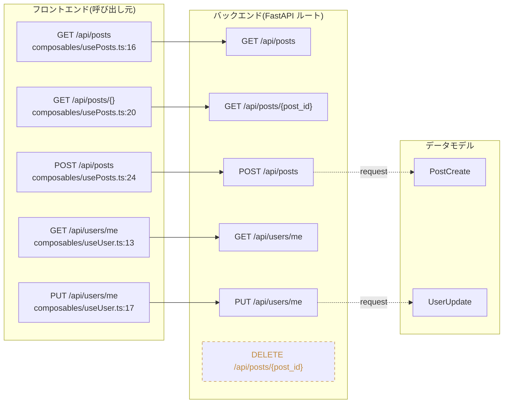

# ApiVista

ApiVistaは、モノレポ構成(`backend/` にFastAPI、`frontend/` にNuxt.js)を持つプロジェクトを対象に、バックエンドのAPIルートとフロントエンドのAPI呼び出しの連携関係をグラフ/ダイアグラムとしてVSCode上に可視化するVSCode拡張機能です。

ルートレベルの連携だけでなく、ファイル単位・関数単位の呼び出しグラフも抽出し、Webview上で表示深度を3段階(ルート連携 / ファイル単位 / 関数単位)に切り替えながら閲覧できます。連携判定はURLパスの静的文字列マッチングとOpenAPIスキーマ照合のハイブリッド方式で行います。

## スコープ

**含まれるもの**

- FastAPI(Python)のルート定義・関数呼び出しグラフの静的抽出。`include_router` の import エイリアス(`from x import router as r`)や f-string prefix(`prefix=f"{API_PREFIX}/devices"`)も解決
- Nuxt.js(Vue/TS)のAPI呼び出しの静的抽出。`$fetch`/`useFetch`/axios の直接呼び出しに加え、**openapi-generator(typescript-axios)で生成された API クライアント**経由の呼び出しも検出
- URLパス静的マッチング + OpenAPIスキーマ照合によるルート⇄フロントエンド呼び出しの連携構築
- 3階層(ルート連携/ファイル単位/関数単位)のデータモデルと深度切り替え
- **ルート連携ビューでのデータモデル/DBテーブルの可視化**: ルートのリクエスト/レスポンスモデル(Pydantic/SQLModel)をノード化し、`table=True`(`__tablename__`)のモデルは DB テーブルノードへ「ルート → モデル → テーブル」と連結
- **連携フィルタ**: 連携に関与するノードのみ表示する「連携のみ」と全ノードを表示する「すべて表示」をトグルで切替。連携するノードは相手と同じ高さに整列(ペア整列)
- VSCode拡張: ワークスペーススキャン、ファイル監視、コマンド、Webviewによるグラフ描画、ソースジャンプ。依存/ビルドディレクトリ(`node_modules`/`.venv`/`__pycache__`等)は走査から除外
- スポット解析: アクティブファイル(およびその属するディレクトリ)に絞った高速解析
- 結果ディスクキャッシュ(stale-while-revalidate): 2回目以降は即時表示しつつバックグラウンドで再解析
- 解析ログ(OutputChannel)と進行中のキャンセル、解析前提条件(WASM/`.py`存在/Pythonバージョン)のプリフライトチェック
- 枠を右クリックして「連携関数をコピー」: 連結する全関数(呼び出し連鎖+ルート連携)をMarkdownでクリップボードへ
- 枠の配色は言語(拡張子)別、左上に言語アイコン表示

**含まれないもの**

- 動的解析・実行時トレース(静的解析のみ)
- FastAPI/Nuxt.js以外のフレームワークサポート
- リクエスト/レスポンスの型不一致検出などの品質検証機能

## 使い方

まずは `Ctrl+Shift+P`(macOS は `Cmd+Shift+P`)でコマンドパレットを開き、「ApiVista」と入力して各コマンドを実行します。最初に「**ApiVista: ルート連携グラフを表示**」を実行するとグラフが開きます。

### コマンド

コマンドパレット(`Ctrl+Shift+P` / `Cmd+Shift+P`)、またはエディタ/エクスプローラの右クリックメニューから実行できます(`.py`/`.ts`/`.js`/`.vue`)。

| コマンド | 説明 |
| --- | --- |
| **ApiVista: ルート連携グラフを表示** | ワークスペース全体を解析し、連携グラフのWebviewを開く(キャッシュがあれば即時表示し背景で再解析) |
| **ApiVista: ワークスペースを再解析** | 現在のグラフを最新のソース状態で更新する |
| **ApiVista: このファイルのルートを解析** | アクティブ/右クリックしたファイルが属する範囲に絞ってスポット解析する |

### グラフの操作

ツールバー(上部)には深度切り替えタブ、「**連携のみ / すべて表示**」トグル、「**⟳ 再解析**」ボタンがあります。

| 操作 | 動作 |
| --- | --- |
| 深度切り替えタブ | ルート連携 / ファイル単位 / 関数単位 の3階層を切り替え(切替後も最後のタブを保持) |
| **「連携のみ / すべて表示」トグル** | 連携に関与するノードのみ表示(既定)と、全ノード表示を切替。連携ペアは同じ高さに整列 |
| **「⟳ 再解析」ボタン** | ワークスペースを再解析して最新状態に更新 |
| 枠(ノード)を左クリック | 選択ハイライト |
| 枠内のファイル名・関数名をクリック | 該当ソースへコードジャンプ(ホバーで下線表示) |
| 枠にマウスオーバー | 連鎖する関数・連携線をハイライトし、それ以外を減光 |
| **右ドラッグ** | グラフ全体をパン(表示位置の移動) |
| ホイール | ズーム(原寸を上限・極小を下限にクランプ。初期表示は常に原寸でコンテンツ最上部) |
| **枠を右クリック →「連携関数をコピー」** | 連結する全関数(呼び出し連鎖+ルート連携)をMarkdownでクリップボードにコピー |

ルート連携ビューでは、ルートに紐づく**データモデル**(「モデル」枠)と、`table=True` のモデルが対応する**DBテーブル**(「DBテーブル」枠)が「ルート → モデル → テーブル」として表示されます。

枠の枠線・アイコンの色は対象ファイルの言語(Python / TypeScript / Vue / JavaScript)で色分けされます。未連携のルート/API呼び出しは破線枠で区別され、解析時の警告は対応する枠または画面下部(折りたたみ可能)にまとめて表示されます。

> 注: 「連携関数をコピー」は事前に「ルート連携グラフを表示」で解析(キャッシュ生成)が必要です。

## 解析結果の例(`../blog-api`)

サンプルプロジェクト `../blog-api`(FastAPI + Nuxt.js)を解析した**ルート連携ビュー**の結果イメージです(実際の解析出力に基づく)。フロントエンドの API 呼び出し(composable)が、バックエンドの FastAPI ルートへ連携され、リクエストモデルがあれば「モデル」枠として連結されます。連携先の無いルート(`DELETE /api/posts/{post_id}`)は未連携として破線で区別されます。



実際のグラフは VSCode の Webview 上に、言語別配色の枠・コードジャンプ・連携線のハイライト付きで描画されます。`../blog-api` の解析サマリ: バックエンド 6 ルート / フロントエンド 5 API 呼び出し / 連携 5 件 / 未連携ルート 1 件(警告 0 件)。

## 技術スタック

- **拡張本体**: TypeScript(VSCode Extension API)
- **バックエンド解析**: TypeScript + web-tree-sitter(WASM、Python文法は `tree-sitter-wasms`)による FastAPI/Python の AST解析
- **フロントエンド解析**: TypeScript + ts-morph による Nuxt.js(Vue/TS)の解析
- **フロントエンド解析対象**: Nuxt.js(Vue/TS)
- **実行環境**: 全解析は拡張ホスト(Node/Electron)上で動作し、エンドユーザーに Python/uv 等の外部ランタイムを要求しない
- **ツール構成**: ESLint / Prettier、Vitest(+jsdom)、`@vscode/test-electron`(テスト)
- **AI開発支援**: Kiro-style Spec-Driven Development、MCPサーバー群(下記参照)

## AI駆動開発で使用した技術

本プロジェクトは **Agentic SDLC(エージェント型ソフトウェア開発ライフサイクル)** で構築されました。コード生成からレビュー・検証まで、すべてのフェーズで AI を中心的に活用しています。

### AI アシスタント

| ツール | バージョン/モデル | 用途 |
| --- | --- | --- |
| **Claude Code** (Anthropic) | claude-sonnet-4-6 | 実装・リファクタリング・デバッグ・ドキュメント生成の主エンジン |
| **Claude Opus** (Anthropic) | claude-opus-4-x | 設計フェーズのアーキテクチャレビュー(`/kiro-spec-design`, `/kiro-validate-design`) |

### 開発方法論

| 方法論 | 説明 |
| --- | --- |
| **Kiro-style Spec-Driven Development** | Discovery → Requirements(EARS形式) → Design → Tasks → Implementation の5フェーズで仕様を先に固め、AI が実装する構造化手法 |
| **Agentic SDLC** | サブエージェントを並列ディスパッチして探索・実装・レビューを自律的に進めるワークフロー |

主なスキル(`/.claude/skills/kiro-*/`):

| スキル | フェーズ | 役割 |
| --- | --- | --- |
| `kiro-spec-init` / `kiro-spec-requirements` | 要件定義 | EARS形式の要件文書を生成 |
| `kiro-spec-design` | 設計 | アーキテクチャ設計・境界コミットメント定義 |
| `kiro-spec-tasks` | タスク化 | 実装タスクの分割と依存順序の整理 |
| `kiro-impl` | 実装 | タスク単位の自律実装(サブエージェント+レビュアー) |
| `kiro-validate-impl` | 検証 | クロスタスク統合・要件カバレッジの検証 |
| `kiro-review` | レビュー | タスク局所の敵対的レビュー |
| `kiro-verify-completion` | 完了ゲート | 成功主張前の証拠検証 |

### MCPサーバー構成

`.mcp.json` で以下のMCPサーバーを構成しています。ツール数の肥大化を避けるため、既存ツール(`gh` CLIや拡張思考)と役割が重複するサーバーは導入していません。

| サーバー | 用途 |
| --- | --- |
| `serena` | セマンティックなコード検索・編集(LSPベース) |
| `context7` | ライブラリの最新ドキュメント取得(FastAPI/Pydantic/tree-sitter/Nuxt等のバージョン追従) |
| `semgrep` | 静的解析による脆弱性スキャン(OWASP Top10系) |

VSCode拡張のWebview検証はブラウザを使用せず、`@vscode/test-electron`(拡張本体の統合テスト)と`vitest`+`jsdom`(Webview内ロジックの単体テスト)でVSCode上で完結させる方針のため、ブラウザ操作系MCP(Playwright等)は導入していません。

`context7` はAPIキーがなくても動作しますが、レート制限緩和のため任意で設定できます。

```bash
export CONTEXT7_API_KEY="..."  # context7.com で取得(任意)
```

設定変更後はClaude Codeの再起動(MCPサーバー再接続)が必要です。

## スペック構成(依存関係順)

プロジェクトは技術領域ごとに4つのスペックに分割されています。全スペック実装済み。

| 順序 | スペック名 | 内容 | 依存 | 状態 |
| --- | --- | --- | --- | --- |
| 1 | `backend-route-extractor` | FastAPIのPythonコードを TypeScript + web-tree-sitter(WASM)で AST解析し、ルート定義(パス・method・OpenAPIスキーマ参照)とファイル/関数単位の呼び出しグラフを抽出する | なし | ✅ 完了 |
| 2 | `frontend-call-extractor` | Nuxt.jsのVue/TSコードを解析し、API呼び出し(URL・method・呼び出し元位置)とコンポーネント/関数単位の呼び出しグラフを抽出する | なし | ✅ 完了 |
| 3 | `route-linkage-engine` | バックエンド/フロントエンドの抽出結果を受け取り、URLパス静的マッチング+OpenAPIスキーマ照合のハイブリッドでルートとAPI呼び出しを連携付け、3階層のデータモデルを構築する | 1, 2 | ✅ 完了 |
| 4 | `vscode-extension-ui` | VSCode拡張本体(アクティベーション、ワークスペーススキャン、ファイル監視、コマンド)とWebviewによるグラフ可視化(深度切り替え、ソースジャンプ)を実装する | 3 | ✅ 完了 |

抽出器(1, 2)は互いに依存せず並行実装が可能です。

## インストール方法

### VSIX から拡張機能をインストール

```bash
code --install-extension apivista-0.1.0.vsix
```

VSCode の拡張機能パネル → 「...」→「VSIXからインストール」でも同様に導入できます。

### 開発環境のセットアップ

本プロジェクトは単一の VSCode 拡張機能(TypeScript)であり、拡張本体・全解析器とも `npm` で完結します。エンドユーザーに Python/uv 等の外部ランタイムは不要です。

```bash
npm install       # 依存インストール
npm run build     # TypeScript コンパイル + Webview バンドル + WASM コピー
npm test          # テスト実行
npm run package   # apivista-{version}.vsix を生成
```

> 注: backend-route-extractor は TypeScript + web-tree-sitter(WASM)で実装されています(旧 Python 実装は撤去済み)。解析対象の Python ソースは `tests/fixtures/sample_app/` にテスト入力としてのみ存在します。

## 開発の進め方

このプロジェクトはKiro-style Spec-Driven Developmentで進めています。各スペックは以下のフェーズを経て実装されます。

1. Discovery(課題・アプローチの整理)
2. Requirements(要件定義、EARS形式)
3. Design(設計)
4. Tasks(実装タスク分割)
5. Implementation(実装)

詳細は各スペックの `.kiro/specs/{feature}/` 配下のドキュメントを参照してください。

## プロジェクト概要ドキュメント

プロジェクトの目的・スコープ・技術スタック・スペック構成・導入方法は `docs/project-overview.md` にまとめています。
