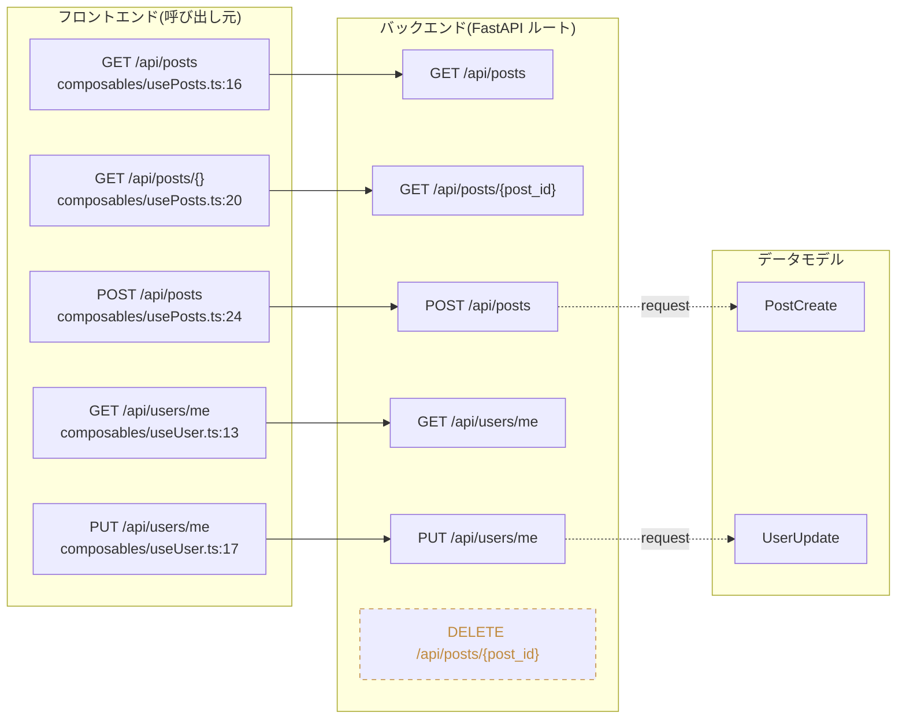

# ApiVista

**FastAPI(バックエンド) と Nuxt.js(フロントエンド) の API 連携を、VSCode 上でグラフ可視化する拡張機能**

「このフロントの呼び出しは、どのバックエンドのルートにつながっているのか?」を、コードを追わずに一目で把握できます。

---

## ApiVista とは

モノレポ構成(`backend/` に FastAPI、`frontend/` に Nuxt.js)のプロジェクトを静的解析し、
**フロントエンドの API 呼び出し ⇄ バックエンドのルート定義**の連携関係をインタラクティブなグラフとして描画します。

- 🔍 **連携が一目でわかる** — フロント(呼び出し元)とバック(ルート)を線で結び、未連携の API も破線で可視化
- 🧭 **3 段階で掘り下げ** — ルート連携 / ファイル単位 / 関数単位 を切り替えて閲覧
- ↔ **コードと往復** — 枠からソースへジャンプ、エディタの行から対応する枠へ逆ジャンプ
- 📋 **連携コードをまとめてコピー** — 連結する関数チェーンを Markdown でクリップボードへ
- ⚡ **外部ランタイム不要** — 解析はすべて拡張内で完結(Python/uv 等のインストール不要)

---

## インストール

1. VSCode の左サイドバーで **拡張機能(Extensions)** ビューを開く(`Ctrl+Shift+X` / macOS は `Cmd+Shift+X`)
2. 検索ボックスに「**ApiVista**」と入力する
3. 表示された ApiVista の「**インストール**」ボタンを押す

> VSIX ファイルを受け取っている場合は、拡張機能ビュー右上の「**...**」→「**VSIX からインストール**」からも導入できます。

---

## クイックスタート

1. FastAPI + Nuxt.js のモノレポ(`backend/`・`frontend/` 構成)を VSCode で開く
2. コマンドパレット(`Ctrl+Shift+P` / macOS は `Cmd+Shift+P`)で「**ApiVista: ルート連携グラフを表示**」を実行
3. 解析が完了するとグラフが開きます。上部タブで深度を切り替え、枠をクリック/ホバーして連携をたどります

> 初回はワークスペース全体を解析します。2 回目以降はキャッシュから即座に表示し、裏で最新状態に更新します。

---

## コマンド

コマンドパレット、またはエディタ/エクスプローラの右クリックメニュー(`.py`/`.ts`/`.js`/`.vue`)から実行できます。

| コマンド | 説明 |
| --- | --- |
| **ApiVista: ルート連携グラフを表示** | ワークスペースを解析し、連携グラフを開く(キャッシュがあれば即時表示) |
| **ApiVista: ワークスペースを再解析** | 現在のグラフを最新のソース状態に更新する |
| **ApiVista: このファイルのルートを解析** | アクティブ/右クリックしたファイルの範囲に絞って高速にスポット解析する |
| **ApiVista: この位置の枠をグラフで表示** | エディタのカーソル位置に対応する枠へグラフ上で逆ジャンプし、強調表示する |

---

## グラフの操作

上部ツールバーに **深度切り替えタブ**、「**連携のみ / すべて表示**」トグル、「**⟳ 再解析**」ボタンがあります。

### マウス

| 操作 | 動作 |
| --- | --- |
| 枠をクリック | 選択(リング表示) |
| `Ctrl`(`Cmd`)+クリック | 複数選択(「選択した枠をコピー」の対象) |
| 枠にマウスオーバー | 連鎖する関数を明るく強調し、依存関係を破線で表示 |
| 枠内のファイル名・関数名をクリック | 該当ソースへコードジャンプ |
| 枠を右クリック | 「**連携関数をコピー**」「**選択した枠をコピー**」メニュー |
| 右ドラッグ | グラフ全体をパン(移動) |
| ホイール | ズーム(原寸〜130% / 縮小は下限までクランプ) |

### キーボード

| キー | 動作 |
| --- | --- |
| 文字入力 | 入力したラベルに前方一致する枠へ移動(タイプ移動) |
| `↑` `↓` `←` `→` | 画面をスクロール |
| `PageUp` / `PageDown` | 1 画面分 上 / 下へスクロール |
| `Ctrl`+`F` | グラフ内の文字列検索 |
| `Esc` | 検索を閉じる |

長くて「…」で省略された枠名・パスは、**マウスを乗せると全文がツールチップ表示**されます。
画面の隅にミニマップが表示され、クリックでその位置へ移動できます。

---

## 表示の見方

### 深度(表示の粒度)

| タブ | 表示内容 |
| --- | --- |
| **ルート連携** | API 呼び出し ⇄ ルートの対応。リクエスト/レスポンスの**データモデル**・**DB テーブル**も連結 |
| **ファイル単位** | ファイル間の依存(import/呼び出し)グラフ |
| **関数単位** | 関数間の呼び出しグラフ |

### 色とスタイル

- 枠の**枠線・アイコンの色**は対象ファイルの言語で色分け(Python / TypeScript / Vue / JavaScript)
- **未連携**のルート/API 呼び出しは**破線枠**で区別
- フロントエンドの枠は `components` / `composables` / `pages` / `utils` / `libs` の**ディレクトリ別の枠**にグループ表示
- 解析時の**警告**は対応する枠、または画面下部(折りたたみ可能)にまとめて表示。警告をクリックすると対象の枠へ移動

### データモデル / DB テーブル(ルート連携ビュー)

ルートに紐づく Pydantic/SQLModel の**モデル**をノード化し、`table=True`(`__tablename__`)のモデルは
**DB テーブル**として「**ルート → モデル → テーブル**」と連結表示します。

### 連携フィルタ

「**連携のみ**」(既定)で連携に関与する枠だけを表示、「**すべて表示**」で全ノードを表示。
連携する枠どうしは相手と同じ高さに整列(ペア整列)され、連携線が追いやすくなります。

---

## 表示例

サンプルプロジェクト(FastAPI + Nuxt.js)の**ルート連携ビュー**のイメージです。フロントの composable が
バックの FastAPI ルートへ連携され、リクエストモデルがあれば「モデル」枠として連結されます。
連携先の無いルート(`DELETE /api/posts/{post_id}`)は破線で区別されます。

実際のグラフは VSCode の Webview 上に、言語別配色・コードジャンプ・連携線のハイライト付きで描画されます。

---

## 対応プロジェクトと動作要件

- **バックエンド**: FastAPI (Python)。`include_router` の import エイリアスや f-string prefix(`prefix=f"{API_PREFIX}/devices"`)も解決
- **フロントエンド**: Nuxt.js (Vue/TS)。`$fetch` / `useFetch` / axios の直接呼び出しに加え、**openapi-generator(typescript-axios)で生成された API クライアント**経由の呼び出しも検出
- 依存/ビルドディレクトリ(`node_modules` / `.venv` / `__pycache__` 等)は走査対象から自動除外
- **外部ランタイム不要** — 解析はすべて拡張ホスト上で完結し、Python/uv 等のインストールは不要

### できないこと(スコープ外)

- 動的解析・実行時トレース(本拡張は**静的解析のみ**)
- FastAPI / Nuxt.js 以外のフレームワーク
- リクエスト/レスポンスの型不一致検出などの品質検証

---

## 開発者向け情報

ビルド方法・アーキテクチャ・テスト戦略・AI 駆動開発の手法など、開発者向けの詳細は **[`docs/`](docs/)** にまとめています。

| ドキュメント | 内容 |
| --- | --- |
| [docs/project-overview.md](docs/project-overview.md) | プロジェクトの目的・スコープ・全体像 |
| [docs/architecture.md](docs/architecture.md) | アーキテクチャ、解析パイプライン、Webview 描画、主要な技術的意思決定 |
| [docs/development.md](docs/development.md) | 開発環境セットアップ、ビルド、テスト戦略、VSIX パッケージング |
| [docs/ai-driven-development.md](docs/ai-driven-development.md) | Agentic SDLC、Kiro Spec-Driven Development、MCP サーバー構成 |
