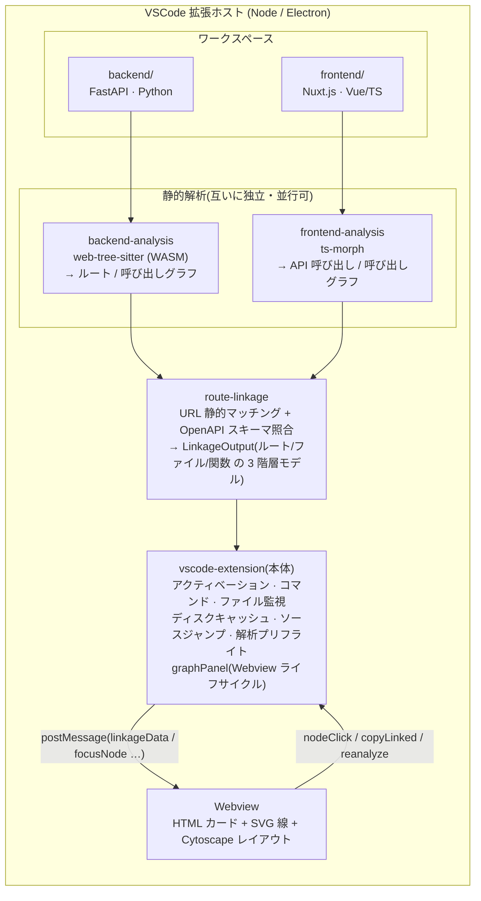

# アーキテクチャ

ApiVista は **単一の VSCode 拡張機能**であり、全構成要素を **TypeScript** で実装し、拡張ホスト(Node.js / Electron)上で動作させます。バックエンド(FastAPI/Python)・フロントエンド(Nuxt.js/Vue/TS)双方の静的解析も拡張ホスト内で完結させ、**エンドユーザーに外部ランタイム(Python / uv 等)やネイティブモジュールの再ビルドを一切要求しません**。

---

## 全体像

すべての構成要素は **VSCode 拡張ホスト(Node/Electron)** 内で動作します。

---

## モジュール構成(`src/`)

| ディレクトリ | スペック | 役割 |
| --- | --- | --- |
| `src/backend-analysis/` | `backend-route-extractor` | FastAPI(Python)を web-tree-sitter(WASM)で AST 解析。ルート定義(パス・method・OpenAPI スキーマ参照)と、ファイル/関数単位の呼び出しグラフを抽出。`include_router` の import エイリアスや f-string prefix も解決する `resolver/` を含む |
| `src/frontend-analysis/` | `frontend-call-extractor` | Nuxt.js(Vue/TS)を ts-morph で解析。`$fetch`/`useFetch`/axios の直接呼び出しと、openapi-generator(typescript-axios)生成クライアント経由の呼び出しを抽出。`resolver/` で URL・呼び出し元を解決 |
| `src/route-linkage/` | `route-linkage-engine` | 両抽出結果を受け取り、URL パス静的マッチング + OpenAPI スキーマ照合のハイブリッドでルート⇄呼び出しを連携付け。3 階層のデータモデル(`LinkageOutput`)を構築 |
| `src/vscode-extension/` | `vscode-extension-ui` | 拡張本体(アクティベーション、ワークスペーススキャン、ファイル監視、コマンド、ディスクキャッシュ)と、`webview/` のグラフ可視化 |
| `src/shared/` | — | 各層が共有する型・ユーティリティ |

抽出器(backend / frontend)は互いに依存せず、並行して実装・テストできます。

---

## 解析パイプライン

1. **プリフライトチェック** — WASM の存在・解析対象 `.py` の存在・前提条件を検査し、満たさなければ早期に分かりやすく失敗させる
2. **ワークスペーススキャン** — `backend/`・`frontend/` ルートを特定。`node_modules`/`.venv`/`__pycache__` 等の依存・ビルドディレクトリは走査から自動除外
3. **バックエンド抽出** — web-tree-sitter で Python を AST 化し、ルートと呼び出しグラフを抽出
4. **フロントエンド抽出** — ts-morph で Vue/TS を解析し、API 呼び出しと呼び出しグラフを抽出
5. **連携構築** — `route-linkage` が URL マッチング + OpenAPI 照合で連携を確定し、`LinkageOutput`(3 階層モデル)を生成
6. **キャッシュ & 描画** — 結果をディスクキャッシュへ保存し、Webview へ `postMessage` で送信して描画

### スポット解析とキャッシュ

- **スポット解析**: アクティブ/右クリックしたファイル(およびその属するディレクトリ)に絞った高速解析
- **ディスクキャッシュ(stale-while-revalidate)**: 2 回目以降はキャッシュを即時表示しつつ、バックグラウンドで再解析して差し替える
- **ファイル監視**: ソース変更を検知し再解析(`reanalysisWatcher`)
- **キャンセル可能**: 進行中の解析は中断でき、`OutputChannel` に解析ログを出力

---

## Webview の描画モデル

グラフ UI(`src/vscode-extension/webview/`)は、可視レイヤと座標計算レイヤを分離しています。

- **Cytoscape.js** は **レイアウト計算・パン・ズーム・座標系**にのみ使用。ノード/エッジ自体は `opacity:0` で**不可視**
- **可視グラフ**は以下の HTML/SVG オーバーレイで構成:
  - **HTML カード**(`nodeCardRenderer.ts`) — 枠の見た目(言語別配色・アイコン・コードジャンプ・警告・ツールチップ)
  - **SVG 線**(`svgRenderer.ts`) — ツリーガイド(主従の構造線)、連携線(フロント⇄バック)、依存線(ホバー時の二次依存を破線で表示)
  - **ミニマップ**(`minimap.ts`)、**検索ボックス**(`searchBox.ts`)、**深度切替**(`depthSwitchControl.ts`)、**右クリックメニュー**(`cardContextMenu.ts`)
- **座標系**: `screenX = pos.x * zoom + pan.x`。枠を中央に寄せるパンは `cy.pan({x: W/2 - pos.x*zoom, y: H/2 - pos.y*zoom})`
- **ホスト⇄Webview プロトコル**(`webviewProtocol.ts`): `linkageData`(解析結果送信)/ `focusNode`(コード→グラフ逆遷移)/ `nodeClick`(ソースジャンプ)/ `copyLinked`・`copySelected`(コピー)/ `reanalyze`

### ビルド時の Webview バンドル

Webview は VSCode の Webview プラットフォーム制約で `vscode` モジュールを実行時に解決できないため、`webview/` 配下は `vscode` を import しません。`esbuild` で IIFE 形式に単独バンドルし(`media/webview/bundle.js`)、`webviewProtocol.ts` などの型のみを共有します。

---

## 主要な技術的意思決定

### 「導入するだけで動く / 全 OS 動作」原則

全解析器は拡張ホスト上で動作し、**エンドユーザーに Python/uv 等の外部ランタイムやネイティブモジュールの再ビルドを要求しない**ことを最優先の制約としています。

- そのため Python 解析に **ネイティブ Node アドオン(node-tree-sitter 等)は不採用**。これらは VSCode の Electron ABI 向け再ビルドと OS/arch 別プリビルドバイナリ同梱が必須で、ABI 不一致やプラットフォーム別の読み込み失敗を招き「導入のみで動作」を壊すため
- 代わりに **WASM 版(web-tree-sitter)** を採用。単一 `.wasm` で全 OS 同一動作し、ネイティブコンパイルが不要

### WASM の扱いの区別

混同しやすい 2 種類の WASM を明確に区別しています。

- **実行ランタイムとしての WASM/WASI(`@vscode/wasm-wasi`)は不採用** — experimental かつ Web 拡張での有効化に既知問題があり、本プロジェクトの解析は Node ネイティブで足りるため
- **ライブラリ実装としての WASM(web-tree-sitter)は採用** — パーサエンジンを WASM 化したライブラリにすぎず、通常の Node/拡張ホスト内で動作する。クロスプラットフォーム性のため採用

### 開発時ツールと配布物の区別

「外部ランタイム不要」原則は**配布される拡張機能のエンドユーザー実行**に対する制約です。開発時のツール(`.mcp.json` の serena/semgrep が使う uvx 等)はこの原則の対象外で、開発者環境にのみ存在すれば十分です(旧 Python 実装で使っていた ruff/pytest は backend の TS 再実装に伴い撤去済み)。

---

## データ契約

`route-linkage` の出力 `LinkageOutput`(`schemaVersion=1`)が、解析層と Webview 層をつなぐ中心的な契約です。ルート/API 呼び出し/ファイル/関数/モデル/テーブルのノードと、`linkage`(連携)/`structural`(構造)エッジ、警告を含みます。Webview はこの単一契約から 3 階層すべての投影(`projectDepth.ts`)を導出します。
